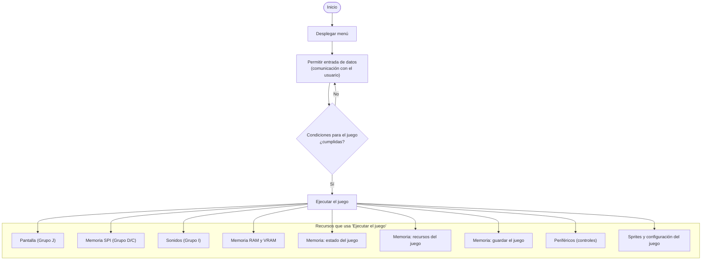

# Proyecto de Electrónica Digital — Consola de 4 videojuegos en paralelo

Propuesta de sistema: una sola placa de desarrollo FPGA (Colorlight 5A-75E, con
un SoC RISC-V tipo femtoriscv como el del repositorio del curso) controla
**4 pantallas simultáneas**, cada una corriendo un juego distinto:
**Pong, Space Invaders, Snake y un juego de carrito**, con hasta 2 jugadores
locales por pantalla.

> Estado: propuesta inicial en construcción. Los supuestos marcados con
> **[SUPUESTO — confirmar]** son puntos donde las notas originales del grupo
> tenían una inconsistencia y se necesita decisión del equipo/profesor.

## 1. Supuestos que hay que confirmar

- **[SUPUESTO — confirmar]** Los controles de juego (Arriba/Abajo/Izquierda/
  Derecha/Start/Select/Botón A/Botón B) usan protocolo **estilo NES**
  (shift register: clock + latch + data), NO el bus PS/2. El PS/2 se reserva
  para teclado/mouse de depuración y configuración del sistema (Grupo E y
  Grupo F). Esto es porque el Grupo G ya existe como `nes_controller.v`,
  que es un protocolo distinto al PS/2.
- **[SUPUESTO — confirmar]** Son **8 controles físicos en total** (2 por
  cada una de las 4 pantallas, para multijugador local de hasta 2
  jugadores por juego) — no 4 controles como decía una nota suelta.

## 2. Entradas y salidas del sistema

**Entradas:**
- 8 controles tipo NES (2 por pantalla) — Grupo G
- Teclado PS/2 — Grupo E (configuración/depuración)
- Mouse PS/2 — Grupo F (configuración/depuración, si aplica)
- Alimentación externa (fuente única para las 4 pantallas)

**Salidas:**
- 4 salidas de video independientes (una por pantalla) — Grupo J
- 4 salidas de audio independientes (una por juego/pantalla) — Grupo I
- Control de brillo de las 4 pantallas

**Almacenamiento / memoria:**
- BRAM interna (Grupo A) — memoria de trabajo del CPU
- SPI RAM (Grupo C) — posible VRAM extendida para los framebuffers de las 4 pantallas
- SPI Flash (Grupo D) — sprites, assets y datos persistentes de cada juego
- I2C (Grupo H) — configuración de periféricos auxiliares (ej. controladores de pantalla/brillo, si aplica)

## 3. Diagrama de bloques del sistema

```mermaid
flowchart TB
    subgraph ENTRADAS["Entradas"]
        C1["Control 1 (NES)"]
        C2["Control 2 (NES)"]
        C3["Control 3 (NES)"]
        C4["Control 4 (NES)"]
        C5["Control 5 (NES)"]
        C6["Control 6 (NES)"]
        C7["Control 7 (NES)"]
        C8["Control 8 (NES)"]
        KBD["Teclado PS/2"]
        MOU["Mouse PS/2"]
    end

    subgraph SOC["SoC RISC-V (femtoriscv) — Placa Colorlight 5A-75E"]
        CPU["CPU RV32I"]
        BRAM["BRAM (Grupo A)"]
        UART["UART (Grupo B)"]
        SPIRAM["SPI RAM ctrl (Grupo C)"]
        SPIFLASH["SPI Flash ctrl (Grupo D)"]
        PS2K["PS2 Keyboard (Grupo E)"]
        PS2M["PS2 Mouse (Grupo F)"]
        NES["NES Controller x8 (Grupo G)"]
        I2C["I2C Master (Grupo H)"]
        I2S["I2S Audio TX (Grupo I)"]
        DISP["Display Driver (Grupo J)"]
        SW["Software de juegos (Grupo K): Pong, Space Invaders, Snake, Carrito"]

        CPU --- BRAM
        CPU --- UART
        CPU --- SPIRAM
        CPU --- SPIFLASH
        CPU --- PS2K
        CPU --- PS2M
        CPU --- NES
        CPU --- I2C
        CPU --- I2S
        CPU --- DISP
        SW -.controla.-> CPU
    end

    subgraph SALIDAS["Salidas"]
        P1["Pantalla 1 (Pong)"]
        P2["Pantalla 2 (Space Invaders)"]
        P3["Pantalla 3 (Snake)"]
        P4["Pantalla 4 (Carrito)"]
        A1["Audio 1"]
        A2["Audio 2"]
        A3["Audio 3"]
        A4["Audio 4"]
    end

    C1 & C2 --> NES
    C3 & C4 --> NES
    C5 & C6 --> NES
    C7 & C8 --> NES
    KBD --> PS2K
    MOU --> PS2M

    DISP --> P1
    DISP --> P2
    DISP --> P3
    DISP --> P4
    I2S --> A1
    I2S --> A2
    I2S --> A3
    I2S --> A4
```



## 4. Diagrama de flujo del software (Grupo K)

Basado en las notas originales del grupo:



## 5. Relación entre los 11 grupos

Cada grupo (A–K) crea su propio repositorio con su módulo, probado de forma
aislada. Al final se integran todos en un único SoC:

| Grupo | Módulo | Se conecta con |
|---|---|---|
| A | `bram.v` | CPU (memoria de trabajo de todos los módulos) |
| B | `uart.v` | CPU (depuración/comunicación externa) |
| C | `spiram_ctrl.v` | CPU, posible VRAM de Grupo J |
| D | `spi_flash_ctrl.v` | CPU, Grupo K (assets/sprites de los juegos) |
| E | `ps2_keyboard.v` | CPU, Grupo K (configuración/depuración) |
| F | `ps2_mouse.v` | CPU, Grupo K (configuración/depuración) |
| G | `nes_controller.v` | CPU, Grupo K (entradas de juego x8) |
| H | `i2c_master.v` | CPU, posibles periféricos de pantalla/brillo |
| I | `i2s_tx.v` | CPU, Grupo K (audio de cada juego) |
| J | `display_driver.v` | CPU, Grupo K (video de cada juego), Grupo C (VRAM) |
| K | `software_juegos` | **Todos los anteriores** — es el software que integra y usa cada periférico |

**Punto crítico de coordinación**: el Grupo K (software de los juegos) no
puede avanzar en la integración real hasta que cada grupo de periférico
publique el **mapa de registros / direcciones de memoria** de su módulo
(qué dirección leer/escribir y qué significa cada bit) — igual que el
ejemplo de la UART y el multiplicador en el repo del profesor. Se
recomienda que cada grupo documente esto en su propio README antes de
la fecha de integración.

## 6. Requisitos de hardware físico (mecánica/gabinete)

- Una caja/gabinete que aloje las 4 pantallas y los 8 botones/controles.
- Una única fuente de alimentación para las 4 pantallas.
- Control de brillo para las 4 pantallas.
- Consideración de experiencia de usuario y ergonomía física (altura,
  distancia entre controles, visibilidad de las 4 pantallas a la vez).

## 7. Estructura de directorios propuesta

```
Proyecto-de-electronica-digital/
├── README.md                     (este archivo)
├── docs/
│   ├── diagrama_bloques.md
│   ├── flujo_software.md
│   └── mapa_de_memoria.md        (a llenar por cada grupo A-J)
├── hardware/
│   ├── grupo_A_bram/
│   ├── grupo_B_uart/
│   ├── grupo_C_spiram/
│   ├── grupo_D_spiflash/
│   ├── grupo_E_ps2_keyboard/
│   ├── grupo_F_ps2_mouse/
│   ├── grupo_G_nes_controller/
│   ├── grupo_H_i2c/
│   ├── grupo_I_i2s/
│   └── grupo_J_display/
├── software/
│   └── grupo_K_juegos/
│       ├── pong/
│       ├── space_invaders/
│       ├── snake/
│       └── carrito/
└── mecanica/
    └── gabinete/
```

## Documentos adicionales

- [`docs/logica_juegos.md`](docs/logica_juegos.md) — placa de desarrollo elegida (Colorlight 5A-75E), máquina de estados interna de cada juego (ejemplo Pong) y experiencia de usuario.
- [`docs/manejo_errores_y_seguridad.md`](docs/manejo_errores_y_seguridad.md) — aislamiento de fallos entre pantallas, manejo de errores en software (watchdog, validación de entrada), y **seguridad física del producto pensado para niños** (cables, gabinete, riesgos eléctricos y mecánicos).

## Preguntas abiertas (pendientes de decisión del equipo)

- ¿Cómo se generan 4 flujos de audio independientes al mismo tiempo desde
  un único I2S? (posible solución: mezclar en software antes de mandar al
  DAC, o usar múltiples canales I2S si el hardware lo permite — pendiente
  de definir con Grupo I).
- ¿Las 4 pantallas comparten resolución/refresco, o cada una puede ser
  independiente? Afecta directamente el diseño del Grupo J y de la VRAM.
