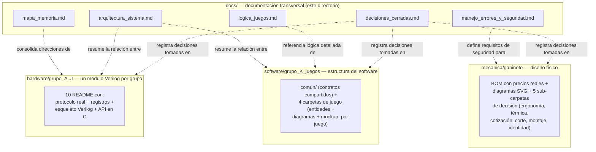

# Documentación del proyecto

Punto de entrada a toda la documentación técnica. El
[`README.md`](../README.md) de la raíz es la presentación general del
proyecto; esta carpeta es donde vive el detalle riguroso de cómo se va
construyendo, para que el equipo y el profesor puedan seguirlo sin
tener que reconstruir la historia leyendo cada commit.

## Cómo está organizada esta carpeta

| Documento | Qué contiene | Cuándo consultarlo |
|---|---|---|
| [`arquitectura_sistema.md`](arquitectura_sistema.md) | Entradas/salidas del sistema completo, diagrama de bloques de los 11 grupos, tabla de relación entre grupos, requisitos físicos | Para entender cómo encaja todo el sistema de punta a punta |
| [`mapa_memoria.md`](mapa_memoria.md) | Las direcciones de TODOS los periféricos (Grupos A–J) en una sola tabla, con su fuente | Antes de escribir código que lea/escriba un registro de hardware |
| [`logica_juegos.md`](logica_juegos.md) | Máquina de estados general de un juego (camino feliz + tabla completa de transiciones), enlaces a la lógica específica de cada uno de los 4 juegos, experiencia de usuario | Para entender el ciclo de vida de una partida |
| [`manejo_errores_y_seguridad.md`](manejo_errores_y_seguridad.md) | Aislamiento de fallos entre pantallas, manejo de errores en software, seguridad física del gabinete (producto para niños) | Antes de diseñar cualquier pieza física o cualquier manejo de error |
| [`decisiones_cerradas.md`](decisiones_cerradas.md) | **Registro central de decisiones**: qué está cerrado, qué es un supuesto sin confirmar, qué sigue abierto — con fecha y justificación de cada una | Para saber el estado actual del proyecto sin leer todo el repo |

## Cómo se conecta esta carpeta con el resto del repositorio

## Regla de mantenimiento de esta carpeta

Cuando se cierre una decisión nueva en cualquier parte del proyecto
(hardware, software o mecánica), se agrega **una fila** en
[`decisiones_cerradas.md`](decisiones_cerradas.md) — no se duplica el
detalle completo aquí, solo se enlaza al README donde vive la
justificación técnica completa. Esto es lo que evita que esta carpeta
se desactualice a medida que el proyecto avanza.
