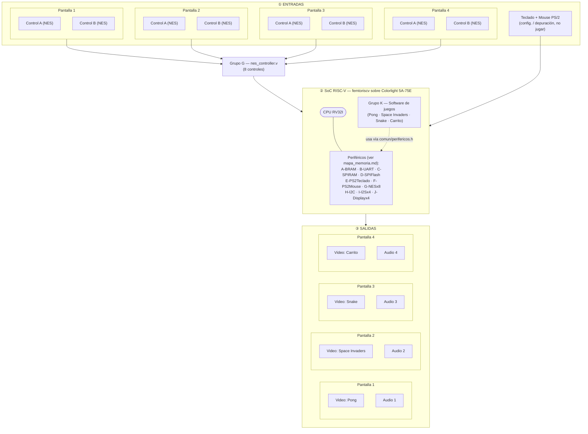

# Arquitectura del sistema

Visión completa de cómo encajan los 11 grupos (A–K) en un solo sistema:
una placa FPGA, un CPU compartido, 4 pantallas independientes. Este
documento reemplaza y amplía el diagrama de bloques que antes vivía
solo en la raíz del [`README.md`](../README.md).

## 1. Entradas y salidas del sistema

**Entradas:**
- 8 controles tipo NES (2 por pantalla, ver [supuesto adoptado #5 y #6](decisiones_cerradas.md#supuestos-adoptados-sin-confirmar-formalmente-)) — Grupo G
- Teclado PS/2 — Grupo E (configuración/depuración, no para jugar)
- Mouse PS/2 — Grupo F (configuración/depuración, si aplica)
- Alimentación externa (fuente única para las 4 pantallas)

**Salidas:**
- 4 salidas de video independientes (una por pantalla, VGA — ver [decisión cerrada #2](decisiones_cerradas.md#decisiones-cerradas-)) — Grupo J
- 4 salidas de audio independientes (una por juego/pantalla, I2S) — Grupo I
- Control de brillo de las 4 pantallas

**Almacenamiento / memoria** (ver detalle completo en [`mapa_memoria.md`](mapa_memoria.md)):
- BRAM interna (Grupo A) — memoria de trabajo del CPU
- SPI RAM (Grupo C) — posible VRAM extendida para los framebuffers
- SPI Flash (Grupo D) — sprites, assets y datos persistentes de cada juego
- I2C (Grupo H) — configuración de periféricos auxiliares (ej. brillo de pantalla)

## 2. Diagrama de bloques del sistema completo

Organización jerárquica: **Entradas (agrupadas por pantalla) → SoC compartido → Salidas (agrupadas por pantalla)**. Cada pantalla es una unidad de principio a fin — así se ve de inmediato el aislamiento de fallos exigido en [`manejo_errores_y_seguridad.md`](manejo_errores_y_seguridad.md).

## 3. Relación entre los 11 grupos

Cada grupo (A–K) crea su propio repositorio con su módulo, probado de
forma aislada. Al final se integran todos en un único SoC:

| Grupo | Módulo | Se conecta con | Estado del contrato (registros/API) |
|---|---|---|---|
| A | `bram.v` | CPU (memoria de trabajo de todos los módulos) | ✅ Documentado — [`hardware/grupo_A_bram`](../hardware/grupo_A_bram/README.md) |
| B | `uart.v` | CPU (depuración/comunicación externa) | ✅ Documentado — [`hardware/grupo_B_uart`](../hardware/grupo_B_uart/README.md) |
| C | `spiram_ctrl.v` | CPU, posible VRAM del Grupo J | ✅ Documentado — [`hardware/grupo_C_spiram`](../hardware/grupo_C_spiram/README.md) |
| D | `spi_flash_ctrl.v` | CPU, Grupo K (assets/sprites) | ✅ Documentado — [`hardware/grupo_D_spiflash`](../hardware/grupo_D_spiflash/README.md) |
| E | `ps2_keyboard.v` | CPU, Grupo K (configuración/depuración) | ✅ Documentado — [`hardware/grupo_E_ps2_keyboard`](../hardware/grupo_E_ps2_keyboard/README.md) |
| F | `ps2_mouse.v` | CPU, Grupo K (configuración/depuración) | ✅ Documentado — [`hardware/grupo_F_ps2_mouse`](../hardware/grupo_F_ps2_mouse/README.md) |
| G | `nes_controller.v` | CPU, Grupo K (entradas de juego ×8) | ✅ Documentado — [`hardware/grupo_G_nes_controller`](../hardware/grupo_G_nes_controller/README.md) |
| H | `i2c_master.v` | CPU, posibles periféricos de pantalla/brillo | ✅ Documentado — [`hardware/grupo_H_i2c`](../hardware/grupo_H_i2c/README.md) |
| I | `i2s_tx.v` | CPU, Grupo K (audio de cada juego) | ✅ Documentado — [`hardware/grupo_I_i2s`](../hardware/grupo_I_i2s/README.md) |
| J | `display_driver.v` | CPU, Grupo K (video), Grupo C (posible VRAM) | ✅ Documentado — [`hardware/grupo_J_display`](../hardware/grupo_J_display/README.md) |
| K | `software_juegos` | **Todos los anteriores** — integra y usa cada periférico | ✅ Estructura creada — [`software/grupo_K_juegos`](../software/grupo_K_juegos/README.md) |

**Punto crítico de coordinación**: el Grupo K no puede avanzar a
implementación real hasta que el mapa de memoria de
[`mapa_memoria.md`](mapa_memoria.md) se valide contra el decodificador
real (`chip_select.v`) del proyecto femtoriscv del curso.

## 4. Requisitos de hardware físico (mecánica/gabinete)

Ver el detalle completo, BOM con precios reales y diagramas en
[`mecanica/gabinete/README.md`](../mecanica/gabinete/README.md).

- Una caja/gabinete (MDF) que aloje las 4 pantallas y los 8 botones/controles.
- Una única fuente de alimentación para las 4 pantallas.
- Ventilación activa (ver [decisión cerrada #4](decisiones_cerradas.md#decisiones-cerradas-)).
- Altura pensada para uso de pie por niños (ver [decisión cerrada #3](decisiones_cerradas.md#decisiones-cerradas-)).
- Seguridad física (bordes, cableado, voltajes) — ver [`manejo_errores_y_seguridad.md`](manejo_errores_y_seguridad.md).

## Documentos relacionados

- [`mapa_memoria.md`](mapa_memoria.md) — mapa de direcciones consolidado de los 10 periféricos
- [`decisiones_cerradas.md`](decisiones_cerradas.md) — registro de todas las decisiones tomadas hasta ahora
- [`logica_juegos.md`](logica_juegos.md) — máquina de estados de un juego y experiencia de usuario
- [`manejo_errores_y_seguridad.md`](manejo_errores_y_seguridad.md) — aislamiento de fallos y seguridad física
