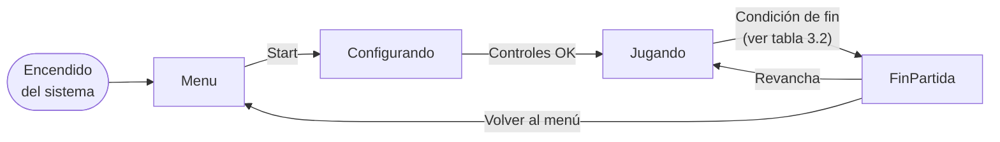

# Lógica interna de los videojuegos

## Placa de desarrollo

**Colorlight 5A-75E** — FPGA Lattice ECP5, flujo 100% open-source
(Yosys + Nextpnr + Project Trellis), la misma que usa el curso en su
[repositorio de ejemplos](https://github.com/johnnycubides/digital-electronic-1-101/tree/main/fpga-example/colorlight-5a-75e).
El SoC corre un núcleo RISC-V RV32I tipo `femtoriscv`, sobre el cual el
Grupo K escribe el software de los 4 juegos en C.

Se eligió esta placa (en vez de diseñar 4 controladores independientes)
porque:
- Es la que el curso ya soporta con toolchain y ejemplos funcionando.
- Permite compartir un solo CPU entre los 4 juegos mediante multiplexado
  por software. **Decisión cerrada (Grupo K, 2026-09-16)**: round-robin
  cooperativo. Detalle completo en
  [`decisiones_cerradas.md`](decisiones_cerradas.md#decisiones-cerradas-).

## Máquina de estados general de un juego

Los 4 juegos (Pong, Space Invaders, Snake, Carrito) comparten el mismo
**esqueleto** de estados — lo que cambia entre uno y otro es solo la
lógica interna del estado `Jugando` (ver la tabla de la sección 3).

### 3.1. Camino feliz (diagrama)

Este es el recorrido normal de una partida, sin pausas ni errores —
deliberadamente simple para que se lea de un vistazo:

### 3.2. Tabla completa de transiciones (incluye pausa y errores)

Las ramas de pausa y manejo de errores se documentan aquí como
**tabla** en vez de meterlas en el mismo diagrama — con 7 estados y
transiciones cruzadas, un solo diagrama se vuelve ilegible (líneas que
se cruzan sin aportar claridad). Esta tabla es la fuente completa y
precisa; el diagrama de arriba es solo el resumen del caso normal.

| Estado origen | Evento | Estado destino | Notas |
|---|---|---|---|
| *(inicio)* | Encendido del sistema | `Menu` | — |
| `Menu` | Jugador presiona Start | `Configurando` | — |
| `Configurando` | Controles verificados OK | `Sirviendo` / `Jugando` | Nombre exacto del sub-estado inicial depende del juego (ver tabla 3.3) |
| `Configurando` | Falla un control | `ErrorControl` | Ver [`manejo_errores_y_seguridad.md`](manejo_errores_y_seguridad.md) |
| `ErrorControl` | Reintentar | `Configurando` | — |
| `ErrorControl` | Timeout / cancelar | `Menu` | — |
| `Jugando` | Condición de fin específica del juego (ver tabla 3.3) | `FinPartida` | — |
| `Jugando` | Botón Select | `Pausa` | — |
| `Pausa` | Reanudar | `Jugando` | Llama `al_reanudar()` de `InterfazJuego` |
| `Pausa` | Salir del juego | `Menu` | — |
| `Jugando` | Fallo de hardware detectado | `ErrorFatal` | Ver [`manejo_errores_y_seguridad.md`](manejo_errores_y_seguridad.md) — reinicia SOLO esta pantalla |
| `ErrorFatal` | Recuperación / reinicio del juego | `Menu` | Watchdog o detección de reconexión de control |
| `FinPartida` | Revancha | `Jugando` (vía `Sirviendo` si aplica) | Llama `inicializar()` de nuevo |
| `FinPartida` | Volver al menú | `Menu` | — |

Esta tabla es exactamente lo que el enum
[`EstadoJuego`](../software/grupo_K_juegos/comun/estado_sistema.h) y la
firma de `actualizar()` en
[`InterfazJuego`](../software/grupo_K_juegos/comun/juego.h) tienen que
soportar — es el contrato entre `main.c` y cada juego.

### 3.3. Lógica específica de "Jugando" por cada juego

Cada juego reemplaza el estado `Jugando` genérico por su propia lógica
interna — ya documentada en detalle (diagrama de bloques + diagrama de
flujo con simbología estándar + mockup de pantalla) en la carpeta de
cada uno:

| Juego | Sub-estado inicial | Condición de fin de partida | Documentación detallada |
|---|---|---|---|
| Pong | `Sirviendo` (pelota en el centro) | Un jugador alcanza `puntaje_maximo` | [`software/grupo_K_juegos/pong/README.md`](../software/grupo_K_juegos/pong/README.md) |
| Space Invaders | `Jugando` (oleada 1 completa) | `vidas == 0` o un enemigo cruza la línea de peligro | [`software/grupo_K_juegos/space_invaders/README.md`](../software/grupo_K_juegos/space_invaders/README.md) |
| Snake | `Jugando` (serpiente de longitud inicial) | Choque contra el borde o contra su propio cuerpo | [`software/grupo_K_juegos/snake/README.md`](../software/grupo_K_juegos/snake/README.md) |
| Carrito | `Jugando` (carril central) | Colisión carro × obstáculo | [`software/grupo_K_juegos/carrito/README.md`](../software/grupo_K_juegos/carrito/README.md) |

Todos conservan los mismos estados de entrada/salida (`Menu`, `Pausa`,
`FinPartida`, `ErrorControl`, `ErrorFatal`) para que el Grupo K tenga
una sola interfaz de integración consistente entre los 4 juegos — ver
[`InterfazJuego`](../software/grupo_K_juegos/comun/juego.h).

## Experiencia de usuario

- El sistema debe ser jugable **sin instrucciones escritas**: un niño
  debe poder acercarse, ver las 4 pantallas encendidas con su menú, y
  entender que presionando Start empieza a jugar.
- Cada pantalla es independiente: un jugador en la Pantalla 1 no debe
  notar ni verse afectado por lo que pase en la Pantalla 2, 3 o 4
  (aislamiento de fallos, ver [`manejo_errores_y_seguridad.md`](manejo_errores_y_seguridad.md)).
- Tiempos de reacción a la entrada del control: deben sentirse
  instantáneos (objetivo tentativo: menor a 50 ms de latencia
  botón→pantalla) — a validar una vez esté el Grupo G y J integrados.

## Documentos relacionados

- [`arquitectura_sistema.md`](arquitectura_sistema.md) — cómo se conectan los 11 grupos
- [`decisiones_cerradas.md`](decisiones_cerradas.md) — por qué se eligió round-robin cooperativo
- [`manejo_errores_y_seguridad.md`](manejo_errores_y_seguridad.md) — `ErrorControl` y `ErrorFatal` en detalle
