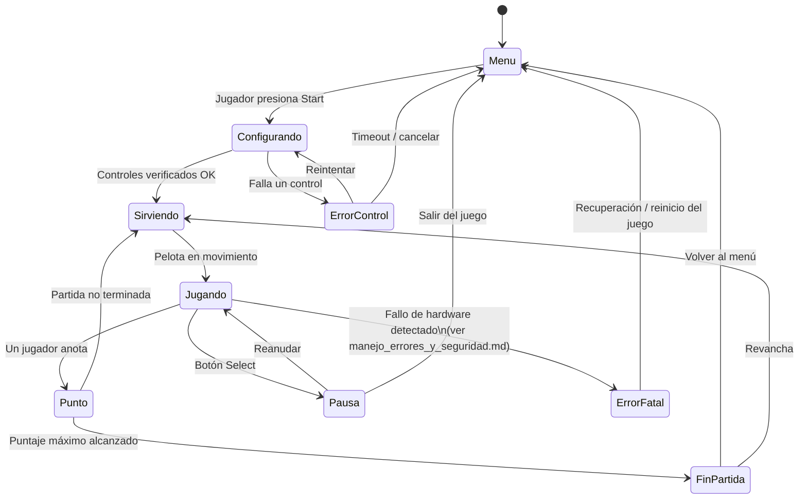

# Lógica interna de los videojuegos

## Placa de desarrollo

**Colorlight 5A-75E** — FPGA Lattice ECP5, flujo 100% open-source
(Yosys + Nextpnr + Project Trellis), la misma que usa el curso en su
[repositorio de ejemplos](https://github.com/johnnycubides/digital-electronic-1-101/tree/main/fpga-example/colorlight-5a-75e).
El SoC corre un núcleo RISC-V RV32I tipo `femtoriscv`, sobre el cual el
Grupo K escribe el software de los 4 juegos en C.

Se eligió esta placa (en vez de diseñar 4 controladores independientes)
porque:
- Es la que el curso ya soporta con toolchain y ejemplos funcionando.
- Permite compartir un solo CPU entre los 4 juegos mediante multiplexado
  por software (cada juego corre su lógica en un slot de tiempo, o cada
  uno como una tarea independiente si el diseño final usa un esquema
  cooperativo/tiempo compartido — a definir con más detalle en la fase
  de diseño del Grupo K).

## Máquina de estados general de un juego (ejemplo: Pong)

Los 4 juegos (Pong, Space Invaders, Snake, Carrito) comparten la misma
estructura general de estados — cambia la lógica interna de "Jugando",
no el esqueleto:

Snake, Space Invaders y el juego de Carrito reemplazan el bloque
"Sirviendo → Jugando → Punto" por su propia lógica (Snake: crecer al
comer / morir al chocar; Space Invaders: oleadas de enemigos / perder
vidas; Carrito: esquivar obstáculos / choque), pero conservan los mismos
estados de entrada/salida (Menu, Pausa, FinPartida, ErrorControl,
ErrorFatal) para que el Grupo K tenga una sola interfaz de integración
consistente entre los 4 juegos.

## Experiencia de usuario

- El sistema debe ser jugable **sin instrucciones escritas**: un niño
  debe poder acercarse, ver las 4 pantallas encendidas con su menú, y
  entender que presionando Start empieza a jugar.
- Cada pantalla es independiente: un jugador en la Pantalla 1 no debe
  notar ni verse afectado por lo que pase en la Pantalla 2, 3 o 4
  (aislamiento de fallos, ver más abajo).
- Tiempos de reacción a la entrada del control: deben sentirse
  instantáneos (objetivo tentativo: menor a 50 ms de latencia
  botón→pantalla) — a validar una vez esté el Grupo G y J integrados.
