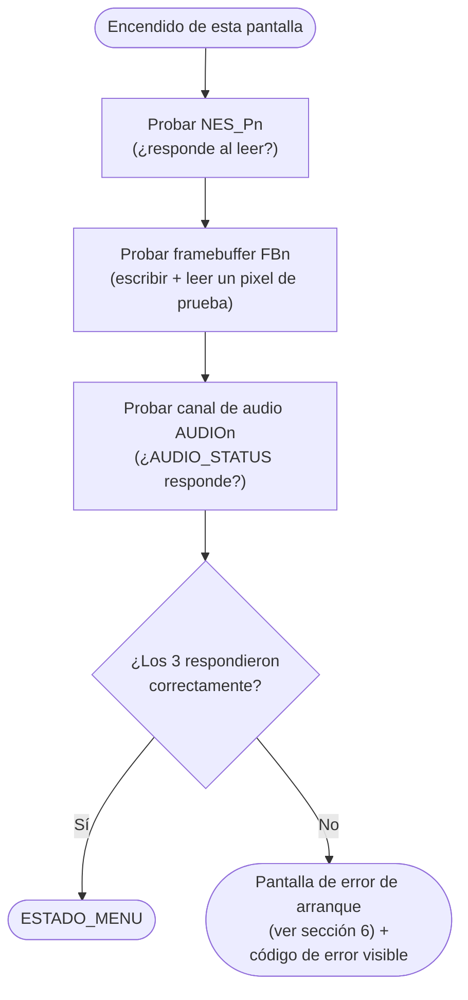

# Manejo de errores y seguridad física (producto dirigido a niños)

> Ver también: [`README.md`](README.md) (índice de toda la
> documentación) y [`decisiones_cerradas.md`](decisiones_cerradas.md)
> (decisiones de gabinete que aplican directamente estos requisitos:
> altura y ventilador).

Este documento existe porque el sistema está dirigido a niños, y los
niños prueban los límites físicos de cualquier cosa (el mismo motivo por
el que un frasco de shampoo trae instrucciones). Hay que diseñar
**asumiendo mal uso real**, no uso ideal.

## 1. Aislamiento de fallos entre las 4 pantallas

**Requisito de diseño no negociable**: si un control, cable o pantalla
falla, **solo esa pantalla se ve afectada** — las otras 3 siguen
funcionando con normalidad. Esto se logra:

- Cada uno de los 8 controles se lee en un registro independiente del
  Grupo G; un control desconectado o dañado no debe bloquear la lectura
  de los demás (leer con timeout, nunca esperar indefinidamente a un
  control que no responde).
- Cada pantalla tiene su propio framebuffer/región de VRAM; un error de
  renderizado en una no debe corromper la memoria de las otras.
- El software del Grupo K debe tratar cada juego como una tarea
  independiente: si la tarea de un juego entra en un estado inválido,
  se reinicia SOLO esa tarea (vuelve a "Menu"), sin reiniciar el sistema
  completo ni afectar a los otros 3 juegos.

## 2. Caso concreto: "el niño pisó un cable y ya no sirve"

Este es exactamente el tipo de falla que hay que anticipar en el diseño
físico, no solo tolerar en el software:

**Prevención (mecánica/hardware):**
- Los cables de los controles NO deben quedar sueltos en el piso: deben
  ir dentro de un canal/conducto fijo al gabinete, o ser lo más cortos
  posible entre el control y el punto de entrada a la caja.
- Usar cable de uso rudo (con recubrimiento reforzado) en los tramos que
  quedan expuestos al usuario, no cable de cobre fino tipo jumper.
- Conectores con retención mecánica (que no se salgan solos al jalar),
  pero que cedan antes de que el cable se rompa (alivio de tensión —
  *strain relief* — en la entrada del conector a la placa).
- Opción a futuro (fuera del alcance de la primera entrega, pero vale
  documentarla): controles inalámbricos eliminarían este riesgo por
  completo.

**Recuperación (software/sistema):**
- Si el Grupo G detecta que un control dejó de responder (línea de
  datos en un estado inválido de forma sostenida), esa pantalla pasa a
  un estado visible de "Control desconectado" en vez de congelarse o
  mostrar un juego roto — así el niño (o un adulto) entiende que hay que
  revisar el cable, y las otras 3 pantallas siguen jugables mientras
  tanto.
- El sistema debe permitir reconectar el control en caliente (sin
  apagar toda la consola) y que esa pantalla vuelva a "Menu"
  automáticamente al detectar la reconexión.

## 3. Seguridad eléctrica y mecánica del gabinete

- Toda la electrónica (placa FPGA, cableado interno, fuente) debe quedar
  **dentro de una caja cerrada**, sin PCBs expuestas al alcance de las
  manos de un niño.
- Solo debe existir bajo voltaje (5V/12V DC) dentro de la caja accesible
  al usuario; cualquier conversión de corriente alterna (110V) debe
  quedar en el adaptador/fuente externa, sellado, nunca dentro de la
  caja que manipulan los niños.
- Sin bordes ni esquinas filosas en el gabinete (bordes redondeados).
- Sin piezas pequeñas desmontables que representen riesgo de asfixia
  (tornillos, perillas sueltas, tapas pequeñas).
- Ventilación diseñada de forma que no se pueda introducir un dedo hasta
  un componente caliente o en movimiento.
- El conector de alimentación externo debe quedar en una posición donde
  no sea fácil de jalar accidentalmente (ej. parte trasera, no al frente
  donde juegan).

## 4. Manejo de errores en la lógica del juego (software)

- **Watchdog por juego**: cada una de las 4 tareas de juego (Grupo K)
  debe tener un temporizador de vigilancia; si una tarea deja de
  responder (se "cuelga") por más de N segundos, el sistema la reinicia
  automáticamente a su estado "Menu" sin afectar a las otras 3.
- **Validación de entrada**: nunca confiar en que el control mande datos
  válidos — si el Grupo G reporta un valor fuera de rango o corrupto,
  descartarlo en vez de dejar que rompa la lógica del juego (un niño
  presionando 8 botones a la vez, muy rápido, repetidamente, es un caso
  de uso real y esperado, no un caso extremo).
- **Persistencia de puntajes/estado**: si el sistema se reinicia de
  forma inesperada (por ejemplo, alguien desconecta la fuente), el
  próximo encendido debe volver limpiamente al menú principal, nunca
  quedar en un estado indefinido que requiera intervención técnica para
  recuperarse.
- **Mensajes de error, si son necesarios, deben ser visuales y simples**
  (un ícono, no texto técnico) — el usuario objetivo no sabe leer
  mensajes de depuración.

## 5. Autodiagnóstico al arrancar (antes de mostrar el menú)

Antes de que cualquier pantalla llegue a `ESTADO_MENU`, `main.c`
recorre cada periférico que va a usar esa pantalla (control NES,
framebuffer/display, audio) y verifica que responda — igual que un PC
hace POST antes de arrancar el sistema operativo. Esto separa "no
prendió" de "prendió mal", que son problemas muy distintos de
diagnosticar para quien esté armando o reparando la consola:

Este autodiagnóstico reutiliza exactamente el mismo mecanismo de
aislamiento de fallos de la sección 1: si el problema es solo, por
ejemplo, el control de la Pantalla 3, únicamente esa pantalla se
queda en estado de error — las otras 3 arrancan con normalidad.

## 6. Códigos de error estandarizados y pantalla de error crítico

Para que un error (de arranque o durante el juego) sea diagnosticable
sin depurador ni monitor serial conectado, cada módulo reporta su
falla con un **código numérico fijo**, mostrado como ícono/número
simple en pantalla (nunca texto técnico ni traza de pila — ver la
regla de la sección 4):

| Código | Módulo | Significado |
|---|---|---|
| `E1` | Grupo G (control NES) | Control no responde / desconectado |
| `E2` | Grupo J (pantalla) | Framebuffer no responde |
| `E3` | Grupo I (audio) | Canal de audio no responde |
| `E4` | Software (Grupo K) | Watchdog: la tarea del juego se colgó |

- **Error no fatal** (`ErrorControl`, ej. `E1`): la pantalla se queda
  en un estado visible simple ("control desconectado, código E1") y
  reintenta automáticamente cuando detecta reconexión — no requiere
  reiniciar nada (ver sección 2).
- **Error fatal** (`ErrorFatal`, ej. `E2`/`E3`/`E4`): la pantalla
  afectada muestra una **pantalla de error crítico** — fondo de un
  solo color sólido con el código grande y un ícono simple — mientras
  el watchdog la reinicia sola a `ESTADO_MENU`. Es deliberadamente
  igual de simple que el resto de la interfaz (sin texto técnico),
  consistente con que el usuario objetivo son niños que no leen
  mensajes de depuración.

Esto no cambia el diseño de aislamiento de fallos ya establecido
(sección 1) — es la forma concreta y visible en que ese aislamiento se
comunica al usuario, y le da a quien arme/repare la consola una pista
inmediata de qué módulo revisar sin necesitar un PC conectado.
