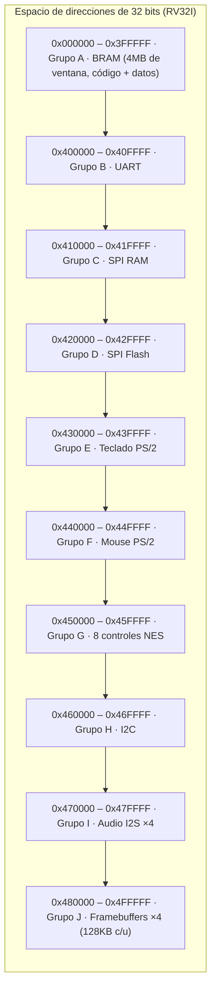

# Mapa de memoria consolidado

Este documento junta en **una sola tabla** el mapa de direcciones que
usa [`software/grupo_K_juegos/comun/perifericos.h`](../software/grupo_K_juegos/comun/perifericos.h)
y cada carpeta `hardware/grupo_*` — para verlo de un vistazo sin abrir
10 archivos distintos.

> **✅ Direcciones OFICIALES, confirmadas 2026-09-16.** Antes esta
> tabla era una propuesta propia sin validar. Se confirmó contra el
> mapa de memoria real del curso — ver
> [`decisiones_cerradas.md`](decisiones_cerradas.md) para el registro
> completo de esa decisión. Los offsets *dentro* de cada ventana de
> 64KB (qué registro va en qué dirección relativa) siguen siendo
> nuestra propia propuesta, consistente entre grupos.

## Tabla completa

| Rango de direcciones | Grupo | Módulo | Registro(s) | R/W | Fuente |
|---|---|---|---|---|---|
| `0x000000` – `0x3FFFFF` | A | `bram` | Memoria de trabajo del CPU (código + datos) | R/W | [`hardware/grupo_A_bram`](../hardware/grupo_A_bram/README.md) |
| `0x400000` | B | `perip_uart` | `UART_DATA` | R/W | [`hardware/grupo_B_uart`](../hardware/grupo_B_uart/README.md) |
| `0x400004` | B | `perip_uart` | `UART_STATUS` | R | [`hardware/grupo_B_uart`](../hardware/grupo_B_uart/README.md) |
| `0x410000` – `0x41FFFB` | C | `perip_spiram` | `SPIRAM_BASE` (datos) | R/W | [`hardware/grupo_C_spiram`](../hardware/grupo_C_spiram/README.md) |
| `0x41FFFC` | C | `perip_spiram` | `SPIRAM_STATUS` | R | [`hardware/grupo_C_spiram`](../hardware/grupo_C_spiram/README.md) |
| `0x420000` – `0x42FFFB` | D | `perip_spiflash` | `FLASH_BASE` (datos: sprites/assets) | R | [`hardware/grupo_D_spiflash`](../hardware/grupo_D_spiflash/README.md) |
| `0x42FFFC` | D | `perip_spiflash` | `FLASH_STATUS` | R | [`hardware/grupo_D_spiflash`](../hardware/grupo_D_spiflash/README.md) |
| `0x430000` | E | `perip_ps2kbd` | `KBD_DATA` | R | [`hardware/grupo_E_ps2_keyboard`](../hardware/grupo_E_ps2_keyboard/README.md) |
| `0x430004` | E | `perip_ps2kbd` | `KBD_STATUS` | R | [`hardware/grupo_E_ps2_keyboard`](../hardware/grupo_E_ps2_keyboard/README.md) |
| `0x440000` | F | `perip_ps2mouse` | `MOUSE_STATUS` | R | [`hardware/grupo_F_ps2_mouse`](../hardware/grupo_F_ps2_mouse/README.md) |
| `0x440004` | F | `perip_ps2mouse` | `MOUSE_DX` | R | [`hardware/grupo_F_ps2_mouse`](../hardware/grupo_F_ps2_mouse/README.md) |
| `0x440008` | F | `perip_ps2mouse` | `MOUSE_DY` | R | [`hardware/grupo_F_ps2_mouse`](../hardware/grupo_F_ps2_mouse/README.md) |
| `0x44000C` | F | `perip_ps2mouse` | `MOUSE_VALID` | R | [`hardware/grupo_F_ps2_mouse`](../hardware/grupo_F_ps2_mouse/README.md) |
| `0x450000` | G | `perip_nes` | `NES_P1` — Pantalla 1, jugador A | R | [`hardware/grupo_G_nes_controller`](../hardware/grupo_G_nes_controller/README.md) |
| `0x450004` | G | `perip_nes` | `NES_P2` — Pantalla 1, jugador B | R | [`hardware/grupo_G_nes_controller`](../hardware/grupo_G_nes_controller/README.md) |
| `0x450008` | G | `perip_nes` | `NES_P3` — Pantalla 2, jugador A | R | [`hardware/grupo_G_nes_controller`](../hardware/grupo_G_nes_controller/README.md) |
| `0x45000C` | G | `perip_nes` | `NES_P4` — Pantalla 2, jugador B | R | [`hardware/grupo_G_nes_controller`](../hardware/grupo_G_nes_controller/README.md) |
| `0x450010` | G | `perip_nes` | `NES_P5` — Pantalla 3, jugador A | R | [`hardware/grupo_G_nes_controller`](../hardware/grupo_G_nes_controller/README.md) |
| `0x450014` | G | `perip_nes` | `NES_P6` — Pantalla 3, jugador B | R | [`hardware/grupo_G_nes_controller`](../hardware/grupo_G_nes_controller/README.md) |
| `0x450018` | G | `perip_nes` | `NES_P7` — Pantalla 4, jugador A | R | [`hardware/grupo_G_nes_controller`](../hardware/grupo_G_nes_controller/README.md) |
| `0x45001C` | G | `perip_nes` | `NES_P8` — Pantalla 4, jugador B | R | [`hardware/grupo_G_nes_controller`](../hardware/grupo_G_nes_controller/README.md) |
| `0x460000` | H | `perip_i2c` | `I2C_ADDR` | R/W | [`hardware/grupo_H_i2c`](../hardware/grupo_H_i2c/README.md) |
| `0x460004` | H | `perip_i2c` | `I2C_DATA` | R/W | [`hardware/grupo_H_i2c`](../hardware/grupo_H_i2c/README.md) |
| `0x460008` | H | `perip_i2c` | `I2C_CTRL` | W | [`hardware/grupo_H_i2c`](../hardware/grupo_H_i2c/README.md) |
| `0x46000C` | H | `perip_i2c` | `I2C_STATUS` | R | [`hardware/grupo_H_i2c`](../hardware/grupo_H_i2c/README.md) |
| `0x470000` | I | `perip_i2s` | `AUDIO1_DATA` — Pantalla 1 | W | [`hardware/grupo_I_i2s`](../hardware/grupo_I_i2s/README.md) |
| `0x470004` | I | `perip_i2s` | `AUDIO2_DATA` — Pantalla 2 | W | [`hardware/grupo_I_i2s`](../hardware/grupo_I_i2s/README.md) |
| `0x470008` | I | `perip_i2s` | `AUDIO3_DATA` — Pantalla 3 | W | [`hardware/grupo_I_i2s`](../hardware/grupo_I_i2s/README.md) |
| `0x47000C` | I | `perip_i2s` | `AUDIO4_DATA` — Pantalla 4 | W | [`hardware/grupo_I_i2s`](../hardware/grupo_I_i2s/README.md) |
| `0x470010` | I | `perip_i2s` | `AUDIO_STATUS` | R | [`hardware/grupo_I_i2s`](../hardware/grupo_I_i2s/README.md) |
| `0x480000` – `0x49FFFF` | J | `perip_display` | `FB1_BASE` — framebuffer Pantalla 1 (128 KB) | R/W | [`hardware/grupo_J_display`](../hardware/grupo_J_display/README.md) |
| `0x4A0000` – `0x4BFFFF` | J | `perip_display` | `FB2_BASE` — framebuffer Pantalla 2 (128 KB) | R/W | [`hardware/grupo_J_display`](../hardware/grupo_J_display/README.md) |
| `0x4C0000` – `0x4DFFFF` | J | `perip_display` | `FB3_BASE` — framebuffer Pantalla 3 (128 KB) | R/W | [`hardware/grupo_J_display`](../hardware/grupo_J_display/README.md) |
| `0x4E0000` – `0x4FFFFF` | J | `perip_display` | `FB4_BASE` — framebuffer Pantalla 4 (128 KB) | R/W | [`hardware/grupo_J_display`](../hardware/grupo_J_display/README.md) |

## Notas importantes

1. **La ventana de BRAM (4 MB) es tamaño de espacio de direcciones, no
   BRAM física garantizada.** La FPGA real tiene bloques internos de
   BRAM mucho más pequeños — ver la nota en
   [`hardware/grupo_A_bram/diagramas/README.md`](../hardware/grupo_A_bram/diagramas/README.md).
2. **El framebuffer ahora tiene 128 KB por pantalla** (antes 16 KB) —
   esto no resuelve por completo el problema de una pantalla a
   640×480 color completo (~460 KB, seguiría sin caber), pero sí da
   mucho más margen para una resolución reducida razonable. Sigue
   siendo un punto de coordinación con Grupo J y Grupo C (ver
   [`decisiones_cerradas.md`](decisiones_cerradas.md)).
3. **El software (Grupo K) usa estas direcciones a través de una sola
   fuente**: [`software/grupo_K_juegos/comun/perifericos.h`](../software/grupo_K_juegos/comun/perifericos.h).
4. **Convención de nombres de módulo**: los periféricos con registros
   de control siguen el patrón `perip_<nombre>.v` (ej. `perip_uart.v`)
   — la BRAM es la única excepción porque no es un periférico con
   registros, es memoria de programa normal.

## Diagrama de espacio de direcciones (vista jerárquica)

