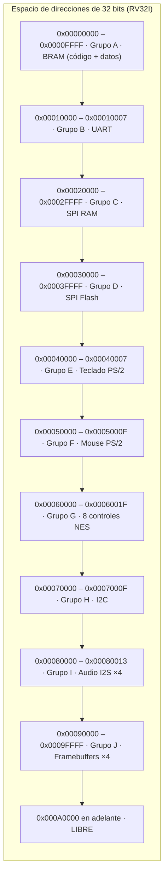

# Mapa de memoria consolidado

Este documento junta en **una sola tabla** el mapa de direcciones que
hoy está repartido entre los 10 README de `hardware/grupo_*` y
[`software/grupo_K_juegos/comun/perifericos.h`](../software/grupo_K_juegos/comun/perifericos.h)
— para que se pueda ver de un vistazo si dos grupos se pisan direcciones,
sin tener que abrir 10 archivos distintos.

> **⚠️ Estado: PROPUESTO.** Ninguna de estas direcciones es definitiva
> todavía — son la propuesta de cada grupo de hardware, consistente
> entre sí (no se pisan), pero **pendiente de validar contra el
> decodificador real (`chip_select.v`)** del proyecto femtoriscv del
> curso. Antes de escribir el primer `main.c` real, alguien debe
> confirmar esto contra el hardware de verdad.

## Tabla completa

| Rango de direcciones | Grupo | Módulo | Registro(s) | R/W | Fuente |
|---|---|---|---|---|---|
| `0x00000000` – `0x0000FFFF` | A | `bram.v` | Memoria de trabajo del CPU (código + datos) | R/W | [`hardware/grupo_A_bram`](../hardware/grupo_A_bram/README.md) |
| `0x00010000` | B | `uart.v` | `UART_DATA` | R/W | [`hardware/grupo_B_uart`](../hardware/grupo_B_uart/README.md) |
| `0x00010004` | B | `uart.v` | `UART_STATUS` | R | [`hardware/grupo_B_uart`](../hardware/grupo_B_uart/README.md) |
| `0x00020000` – `0x0002FFFB` | C | `spiram_ctrl.v` | `SPIRAM_BASE` (datos) | R/W | [`hardware/grupo_C_spiram`](../hardware/grupo_C_spiram/README.md) |
| `0x0002FFFC` | C | `spiram_ctrl.v` | `SPIRAM_STATUS` | R | [`hardware/grupo_C_spiram`](../hardware/grupo_C_spiram/README.md) |
| `0x00030000` – `0x0003FFFB` | D | `spi_flash_ctrl.v` | `FLASH_BASE` (datos: sprites/assets) | R | [`hardware/grupo_D_spiflash`](../hardware/grupo_D_spiflash/README.md) |
| `0x0003FFFC` | D | `spi_flash_ctrl.v` | `FLASH_STATUS` | R | [`hardware/grupo_D_spiflash`](../hardware/grupo_D_spiflash/README.md) |
| `0x00040000` | E | `ps2_keyboard.v` | `KBD_DATA` | R | [`hardware/grupo_E_ps2_keyboard`](../hardware/grupo_E_ps2_keyboard/README.md) |
| `0x00040004` | E | `ps2_keyboard.v` | `KBD_STATUS` | R | [`hardware/grupo_E_ps2_keyboard`](../hardware/grupo_E_ps2_keyboard/README.md) |
| `0x00050000` | F | `ps2_mouse.v` | `MOUSE_STATUS` | R | [`hardware/grupo_F_ps2_mouse`](../hardware/grupo_F_ps2_mouse/README.md) |
| `0x00050004` | F | `ps2_mouse.v` | `MOUSE_DX` | R | [`hardware/grupo_F_ps2_mouse`](../hardware/grupo_F_ps2_mouse/README.md) |
| `0x00050008` | F | `ps2_mouse.v` | `MOUSE_DY` | R | [`hardware/grupo_F_ps2_mouse`](../hardware/grupo_F_ps2_mouse/README.md) |
| `0x0005000C` | F | `ps2_mouse.v` | `MOUSE_VALID` | R | [`hardware/grupo_F_ps2_mouse`](../hardware/grupo_F_ps2_mouse/README.md) |
| `0x00060000` | G | `nes_controller.v` | `NES_P1` — Pantalla 1, jugador A | R | [`hardware/grupo_G_nes_controller`](../hardware/grupo_G_nes_controller/README.md) |
| `0x00060004` | G | `nes_controller.v` | `NES_P2` — Pantalla 1, jugador B | R | [`hardware/grupo_G_nes_controller`](../hardware/grupo_G_nes_controller/README.md) |
| `0x00060008` | G | `nes_controller.v` | `NES_P3` — Pantalla 2, jugador A | R | [`hardware/grupo_G_nes_controller`](../hardware/grupo_G_nes_controller/README.md) |
| `0x0006000C` | G | `nes_controller.v` | `NES_P4` — Pantalla 2, jugador B | R | [`hardware/grupo_G_nes_controller`](../hardware/grupo_G_nes_controller/README.md) |
| `0x00060010` | G | `nes_controller.v` | `NES_P5` — Pantalla 3, jugador A | R | [`hardware/grupo_G_nes_controller`](../hardware/grupo_G_nes_controller/README.md) |
| `0x00060014` | G | `nes_controller.v` | `NES_P6` — Pantalla 3, jugador B | R | [`hardware/grupo_G_nes_controller`](../hardware/grupo_G_nes_controller/README.md) |
| `0x00060018` | G | `nes_controller.v` | `NES_P7` — Pantalla 4, jugador A | R | [`hardware/grupo_G_nes_controller`](../hardware/grupo_G_nes_controller/README.md) |
| `0x0006001C` | G | `nes_controller.v` | `NES_P8` — Pantalla 4, jugador B | R | [`hardware/grupo_G_nes_controller`](../hardware/grupo_G_nes_controller/README.md) |
| `0x00070000` | H | `i2c_master.v` | `I2C_ADDR` | R/W | [`hardware/grupo_H_i2c`](../hardware/grupo_H_i2c/README.md) |
| `0x00070004` | H | `i2c_master.v` | `I2C_DATA` | R/W | [`hardware/grupo_H_i2c`](../hardware/grupo_H_i2c/README.md) |
| `0x00070008` | H | `i2c_master.v` | `I2C_CTRL` | W | [`hardware/grupo_H_i2c`](../hardware/grupo_H_i2c/README.md) |
| `0x0007000C` | H | `i2c_master.v` | `I2C_STATUS` | R | [`hardware/grupo_H_i2c`](../hardware/grupo_H_i2c/README.md) |
| `0x00080000` | I | `i2s_tx.v` | `AUDIO1_DATA` — Pantalla 1 | W | [`hardware/grupo_I_i2s`](../hardware/grupo_I_i2s/README.md) |
| `0x00080004` | I | `i2s_tx.v` | `AUDIO2_DATA` — Pantalla 2 | W | [`hardware/grupo_I_i2s`](../hardware/grupo_I_i2s/README.md) |
| `0x00080008` | I | `i2s_tx.v` | `AUDIO3_DATA` — Pantalla 3 | W | [`hardware/grupo_I_i2s`](../hardware/grupo_I_i2s/README.md) |
| `0x0008000C` | I | `i2s_tx.v` | `AUDIO4_DATA` — Pantalla 4 | W | [`hardware/grupo_I_i2s`](../hardware/grupo_I_i2s/README.md) |
| `0x00080010` | I | `i2s_tx.v` | `AUDIO_STATUS` | R | [`hardware/grupo_I_i2s`](../hardware/grupo_I_i2s/README.md) |
| `0x00090000` – `0x00093FFF` | J | `display_driver.v` | `FB1_BASE` — framebuffer Pantalla 1 | R/W | [`hardware/grupo_J_display`](../hardware/grupo_J_display/README.md) |
| `0x00094000` – `0x00097FFF` | J | `display_driver.v` | `FB2_BASE` — framebuffer Pantalla 2 | R/W | [`hardware/grupo_J_display`](../hardware/grupo_J_display/README.md) |
| `0x00098000` – `0x0009BFFF` | J | `display_driver.v` | `FB3_BASE` — framebuffer Pantalla 3 | R/W | [`hardware/grupo_J_display`](../hardware/grupo_J_display/README.md) |
| `0x0009C000` – `0x0009FFFF` | J | `display_driver.v` | `FB4_BASE` — framebuffer Pantalla 4 | R/W | [`hardware/grupo_J_display`](../hardware/grupo_J_display/README.md) |

## Notas importantes

1. **El tamaño de los 4 framebuffers (`0x00090000`–`0x0009FFFF`, 64 KB
   total) asume una resolución baja, todavía sin confirmar.** A
   640×480 a color completo, UN SOLO framebuffer pesaría ~460 KB — no
   caben los 4 en ese rango ni en BRAM interna. Ver el detalle del
   problema y las opciones reales en
   [`hardware/grupo_J_display/README.md`](../hardware/grupo_J_display/README.md#mapa-de-memoria-propuesto--validar-contra-el-decodificador-real-chip_selectv)
   y en el registro de decisiones
   ([`decisiones_cerradas.md`](decisiones_cerradas.md#punto-de-coordinación-activo-no-es-una-decisión-es-un-riesgo-técnico-documentado)).
2. **El software (Grupo K) usa estas direcciones a través de una sola
   fuente**: [`software/grupo_K_juegos/comun/perifericos.h`](../software/grupo_K_juegos/comun/perifericos.h)
   — ningún juego debe repetir una dirección "a mano", todos incluyen
   ese header.
3. **Rangos libres para futuros periféricos**: `0x000A0000` en
   adelante no está asignado a ningún grupo todavía.

## Diagrama de espacio de direcciones (vista jerárquica)

