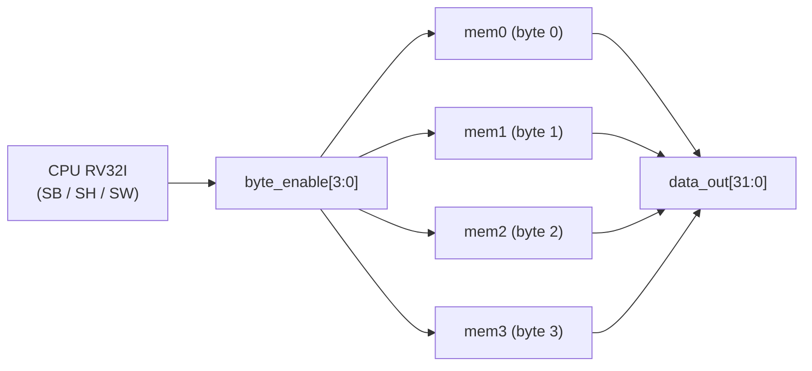

# Diagramas — BRAM

## Por qué 4 bancos de 8 bits (no un banco de 32 bits)

Partir la memoria en 4 bancos de 8 bits (uno por byte) es lo que
permite escribir por byte **sin** leer-modificar-escribir la palabra
completa — así funciona de verdad `SB`/`SH` del RISC-V: el compilador
de C genera esas instrucciones para variables `char`/`short`, y sin
esto el programa falla de forma silenciosa y difícil de depurar.

## Ventana de direcciones vs. BRAM física real de la FPGA

La ventana de direcciones oficial del curso reserva **4 MB**
(`0x000000`–`0x3FFFFF`, ver
[`../../../docs/mapa_memoria.md`](../../../docs/mapa_memoria.md)) para
este módulo — pero eso es tamaño de **espacio de direcciones**, no
memoria física garantizada. La FPGA Lattice ECP5 del Colorlight
5A-75E tiene bloques de BRAM internos de un tamaño real mucho menor
(del orden de decenas/cientos de KB según el modelo exacto de ECP5,
no varios MB). En la práctica, el programa de los 4 juegos + su pila
solo va a usar una fracción pequeña de esa ventana — se debe medir el
tamaño real necesario con el `.elf` compilado una vez exista
`software/grupo_K_juegos/comun/main.c`, no reservar los 4MB completos
como BRAM física.
