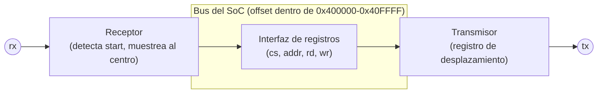

# Diagramas — UART

## Trama de un byte (8N1)

```
reposo  start  d0  d1  d2  d3  d4  d5  d6  d7  stop  reposo
  1  ──▁──┤ 0 │ ¹  ¹  ¹  ¹  ¹  ¹  ¹  ¹ │ 1 │──────  1
          └───┴──┴──┴──┴──┴──┴──┴──┴──┴───┘
          cada casilla dura 1/BAUD segundos
```

- 1 bit de start (siempre 0), 8 bits de datos **LSB primero**, sin
  paridad, 1 bit de stop (siempre 1).
- El receptor detecta el **flanco de bajada** del bit de start y
  espera **medio periodo de bit** antes de tomar la primera muestra —
  así cae justo al centro de cada bit, lejos de los bordes donde la
  señal puede no haberse estabilizado (ver `perip_uart.v`, señal
  `rx_count <= DIV/2`).

## Diagrama de bloques interno



## Tabla de registros (ver también el README de esta carpeta)

| Registro | Offset | R/W | Bit | Significado |
|---|---|---|---|---|
| `UART_DATA` | `0x00` | R/W | `[7:0]` | Escribir: byte a transmitir. Leer: último byte recibido |
| `UART_STATUS` | `0x04` | R | bit0 | `tx_busy` — 1 mientras se transmite un byte |
| `UART_STATUS` | `0x04` | R | bit1 | `rx_valid` — 1 cuando hay un byte nuevo sin leer |
