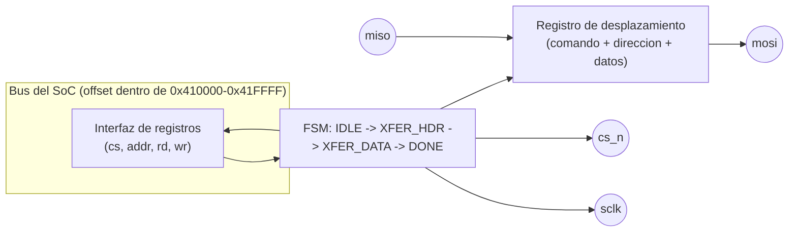
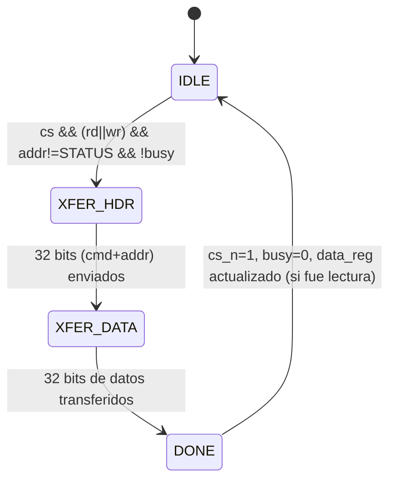

# Diagramas — SPI RAM

## Protocolo SPI (modo 0, CPOL=0 / CPHA=0)

```
cs_n ──╲___________________________________________________╱──
sclk ────╱▔╲_╱▔╲_╱▔╲_...(32 bits cmd+addr)..._╱▔╲_...(32 bits datos)...
mosi     [d31            comando(8) + direccion(24)          d0]
miso                                                    [d31  datos  d0]  (solo lectura)
```

- El maestro cambia `mosi` en el **flanco de bajada** de `sclk` y el
  esclavo muestrea/entrega en el **flanco de subida** — estándar SPI
  modo 0 (ver `perip_spiram.v`, señal `sclk`).
- Cada transacción manda primero un **header de 32 bits**: comando
  (`0x02` escritura / `0x03` lectura, 8 bits) + dirección externa de
  24 bits (el offset de la ventana de 64KB, extendido con ceros).
  Luego siguen 32 bits más: el dato a escribir (por `mosi`) o el dato
  leído (por `miso`).
- Mientras dura la transacción (64 bits en total = header + datos),
  el bit `busy` de `SPIRAM_STATUS` permanece en 1.

## Diagrama de bloques interno



## Máquina de estados



## Tabla de registros (ver también el README de esta carpeta)

| Registro | Offset | R/W | Descripción |
|---|---|---|---|
| `SPIRAM_DATA` | `0x0000` – `0xFFFB` | R/W | Ventana de datos pass-through hacia la RAM SPI externa (cada acceso dispara una transacción) |
| `SPIRAM_STATUS` | `0xFFFC` | R | bit0 = `busy` — 1 mientras dura una transacción SPI en curso |
