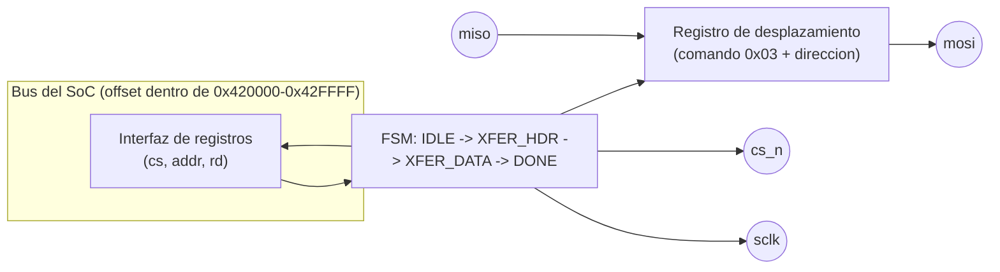
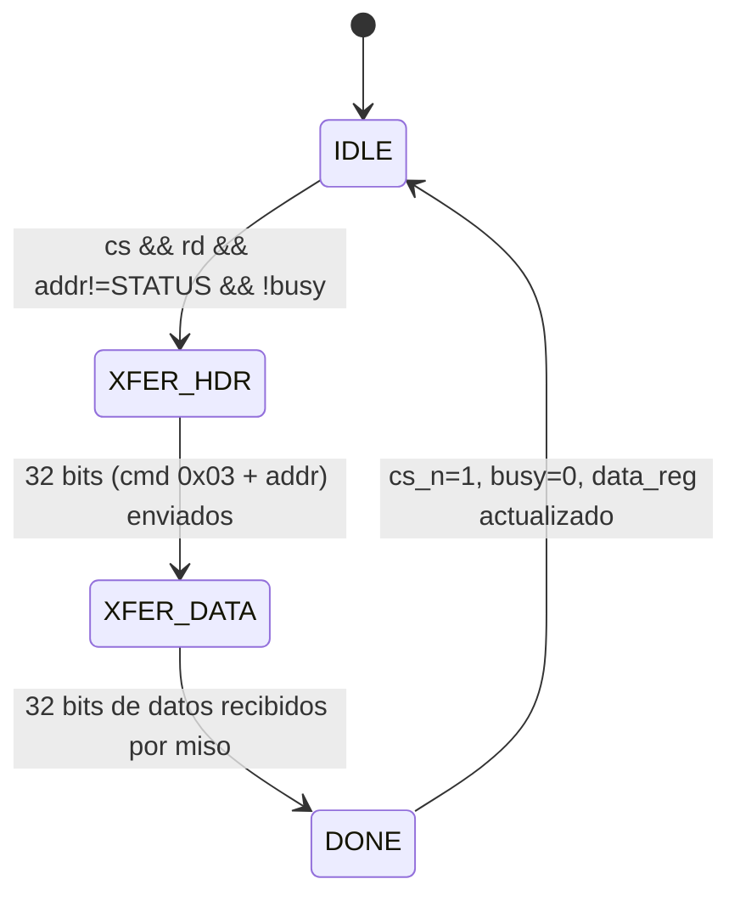

# Diagramas — SPI Flash

## Protocolo SPI (modo 0, CPOL=0 / CPHA=0) — solo lectura

```
cs_n ──╲_______________________________________________╱──
sclk ────╱▔╲_╱▔╲_...(32 bits: cmd 0x03 + direccion 24b)..._╱▔╲_...(32 bits datos)...
mosi     [d31         comando(8) + direccion(24)        d0]
miso                                              [d31   datos leidos   d0]
```

- El maestro cambia `mosi` en el **flanco de bajada** de `sclk` y
  muestrea `miso` en el **flanco de subida** — estándar SPI modo 0
  (idéntico al usado por `perip_spiram`, ver
  [`../../grupo_C_spiram/diagramas/README.md`](../../grupo_C_spiram/diagramas/README.md)).
- Comando fijo `0x03` (JEDEC READ, hasta ~25 MHz) — **nunca** `0x02`
  (WRITE): este periférico es de solo lectura desde el punto de vista
  del juego. `0x0B` (FAST READ, con byte dummy) queda documentado como
  posible mejora futura si se necesita más ancho de banda, pero no está
  implementado.
- Mientras dura la transacción (64 bits: header + datos), el bit
  `busy` de `FLASH_STATUS` permanece en 1.

## Diagrama de bloques interno



## Máquina de estados



## Tabla de registros (ver también el README de esta carpeta)

| Registro | Offset | R/W | Descripción |
|---|---|---|---|
| `FLASH_DATA` | `0x0000` – `0xFFFB` | R (solo lectura) | Ventana de assets (sprites, niveles, paletas) — cada acceso dispara una transacción SPI |
| `FLASH_STATUS` | `0xFFFC` | R | bit0 = `busy` — 1 mientras dura una transacción SPI en curso |
