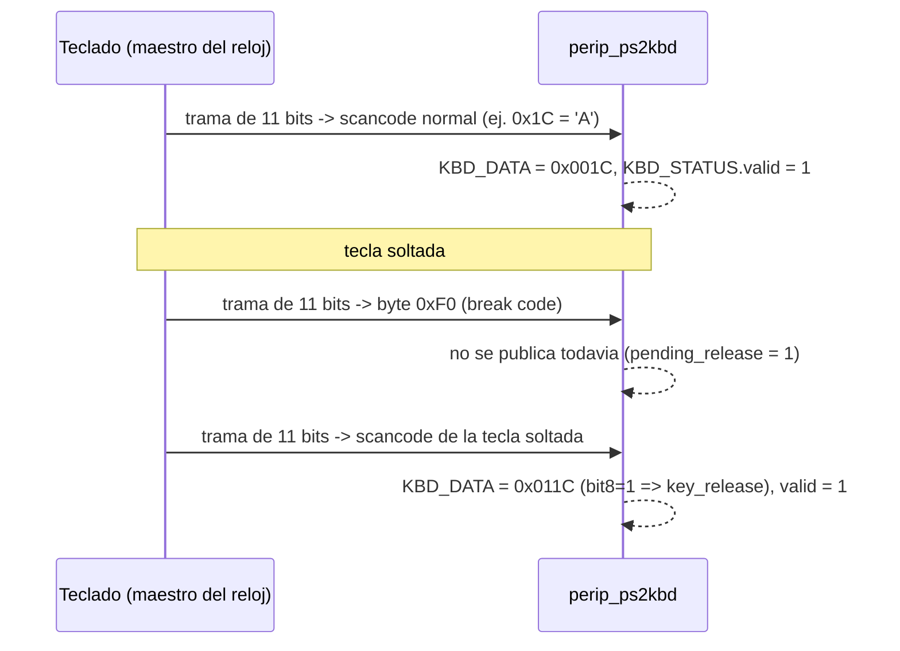
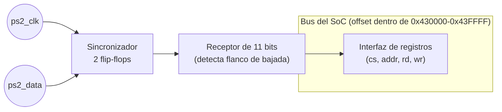

# Diagramas — Teclado PS/2

## Trama de un byte (11 bits, protocolo PS/2)

```
reposo  start  d0  d1  d2  d3  d4  d5  d6  d7  parity  stop  reposo
  1  ──▁──┤ 0 │ ¹  ¹  ¹  ¹  ¹  ¹  ¹  ¹ │  P   │ 1 │──────  1
          └───┴──┴──┴──┴──┴──┴──┴──┴──┴──────┴───┘
          cada bit se muestrea en el flanco de BAJADA de PS2_CLK
```

- 1 bit de start (siempre 0), 8 bits de datos **LSB primero**, 1 bit de
  **paridad impar** (P), 1 bit de stop (siempre 1).
- A diferencia de UART, **el dispositivo (teclado) genera el reloj**
  (`PS2_CLK`, 10–16.7 kHz), no la FPGA — el receptor solo escucha.
- El receptor detecta el **flanco de bajada** de `PS2_CLK` (ya
  sincronizado con doble flip-flop) y en ese instante toma la muestra
  de `PS2_DATA` (ver `rtl/perip_ps2kbd.v`, bloque "Receptor").

## Secuencia de "tecla soltada" (Scan Code Set 2)



- Tecla extendida (flechas, etc.): el teclado antepone `0xE0` antes del
  scancode. El módulo lo entrega como un byte crudo más — la
  traducción de la secuencia completa (`0xE0` + scancode, o
  `0xF0` + scancode) a una tecla lógica se hace en **software**
  (Grupo K), no en `perip_ps2kbd.v`.

## Diagrama de bloques interno



## Tabla de registros (ver también el README de esta carpeta)

| Registro | Offset | R/W | Bit | Significado |
|---|---|---|---|---|
| `KBD_DATA` | `0x00` | R | `[7:0]` | Scancode crudo (Scan Code Set 2) |
| `KBD_DATA` | `0x00` | R | `[8]` | `key_release` — 1 si venía precedido de `0xF0` |
| `KBD_STATUS` | `0x04` | R | `[0]` | `valid` — 1 cuando hay un scancode nuevo sin leer (se limpia al leer `KBD_DATA`) |
