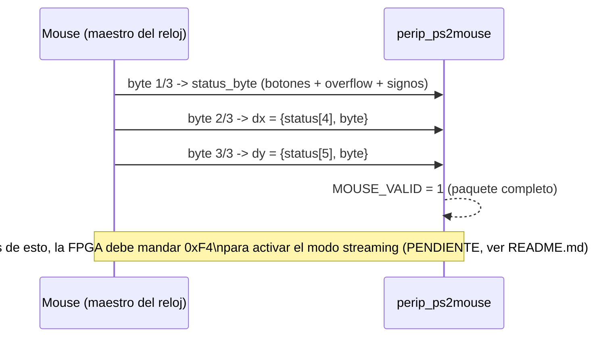
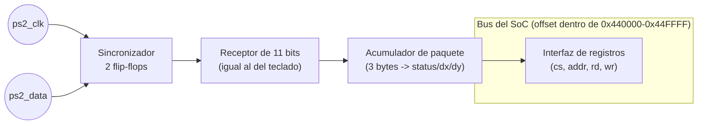

# Diagramas — Mouse PS/2

## Trama de un byte (11 bits, protocolo PS/2 — idéntica a nivel de bits a la del teclado)

```
reposo  start  d0  d1  d2  d3  d4  d5  d6  d7  parity  stop  reposo
  1  ──▁──┤ 0 │ ¹  ¹  ¹  ¹  ¹  ¹  ¹  ¹ │  P   │ 1 │──────  1
          └───┴──┴──┴──┴──┴──┴──┴──┴──┴──────┴───┘
          cada bit se muestrea en el flanco de BAJADA de PS2_CLK
```

Mismo receptor de bytes de 11 bits que usa el teclado (Grupo E) — ver
también [`../../grupo_E_ps2_keyboard/diagramas/README.md`](../../grupo_E_ps2_keyboard/diagramas/README.md).

## Paquete de reporte del mouse (3 bytes)

```
Byte 1 (status):  [Y-overflow][X-overflow][Y-sign][X-sign][1][middle-btn][right-btn][left-btn]
Byte 2 (dx):       delta X, complemento a 2 (bit de signo va en status[4])
Byte 3 (dy):       delta Y, complemento a 2 (bit de signo va en status[5])
```



## Diagrama de bloques interno



## Tabla de registros (ver también el README de esta carpeta)

| Registro | Offset | R/W | Significado |
|---|---|---|---|
| `MOUSE_STATUS` | `0x00` | R | byte de estado crudo: bit0=left, bit1=right, bit2=middle, bit3=1 fijo, bit4=X-sign, bit5=Y-sign, bit6/7=overflow |
| `MOUSE_DX` | `0x04` | R | delta X con signo (extendido a 32 bits) |
| `MOUSE_DY` | `0x08` | R | delta Y con signo (extendido a 32 bits) |
| `MOUSE_VALID` | `0x0C` | R | bit0 = paquete nuevo disponible (se limpia al leer) |
