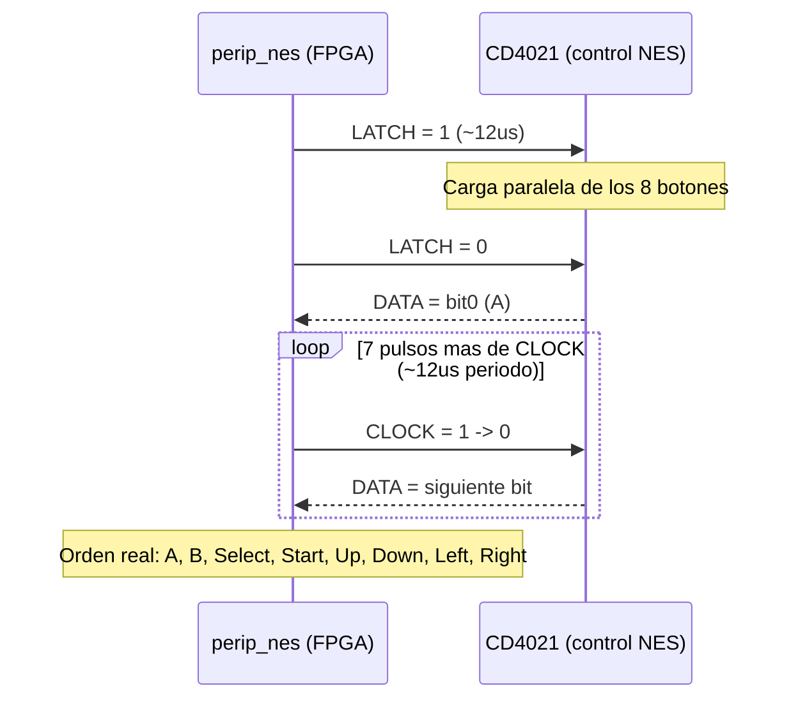
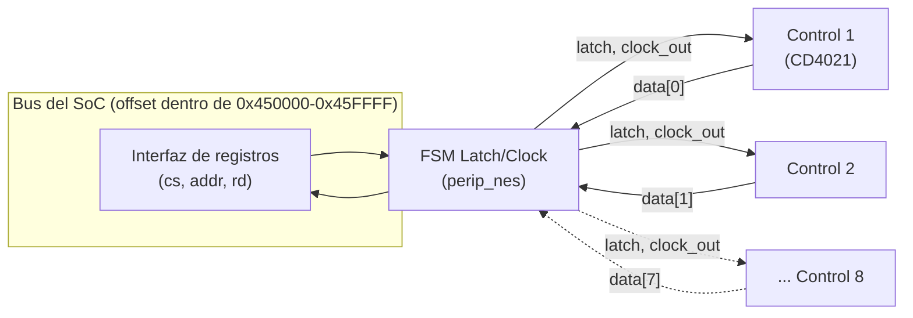

# Diagramas — NES Controller

## Secuencia Latch/Clock (lectura de 1 control, CD4021)

- `LATCH` y `CLOCK` son compartidas por los 8 controles (se leen los 8 en
  paralelo, al mismo tiempo); `DATA` es una línea individual por control.
- Un control desconectado lee todo en 1 (pull-up de `DATA` sin nada
  enchufado) — ver "Errores comunes" en el README de esta carpeta.

## Diagrama de bloques (8 controles, líneas compartidas)

## Tabla de registros (ver también el README de esta carpeta)

| Registro | Offset | R/W | Descripción |
|---|---|---|---|
| `NES_P1` | `0x00` | R | Pantalla 1, jugador A |
| `NES_P2` | `0x04` | R | Pantalla 1, jugador B |
| `NES_P3` | `0x08` | R | Pantalla 2, jugador A |
| `NES_P4` | `0x0C` | R | Pantalla 2, jugador B |
| `NES_P5` | `0x10` | R | Pantalla 3, jugador A |
| `NES_P6` | `0x14` | R | Pantalla 3, jugador B |
| `NES_P7` | `0x18` | R | Pantalla 4, jugador A |
| `NES_P8` | `0x1C` | R | Pantalla 4, jugador B |

Bits de cada registro (igual para los 8): `bit0`=A, `bit1`=B,
`bit2`=Select, `bit3`=Start, `bit4`=Up, `bit5`=Down, `bit6`=Left,
`bit7`=Right.
