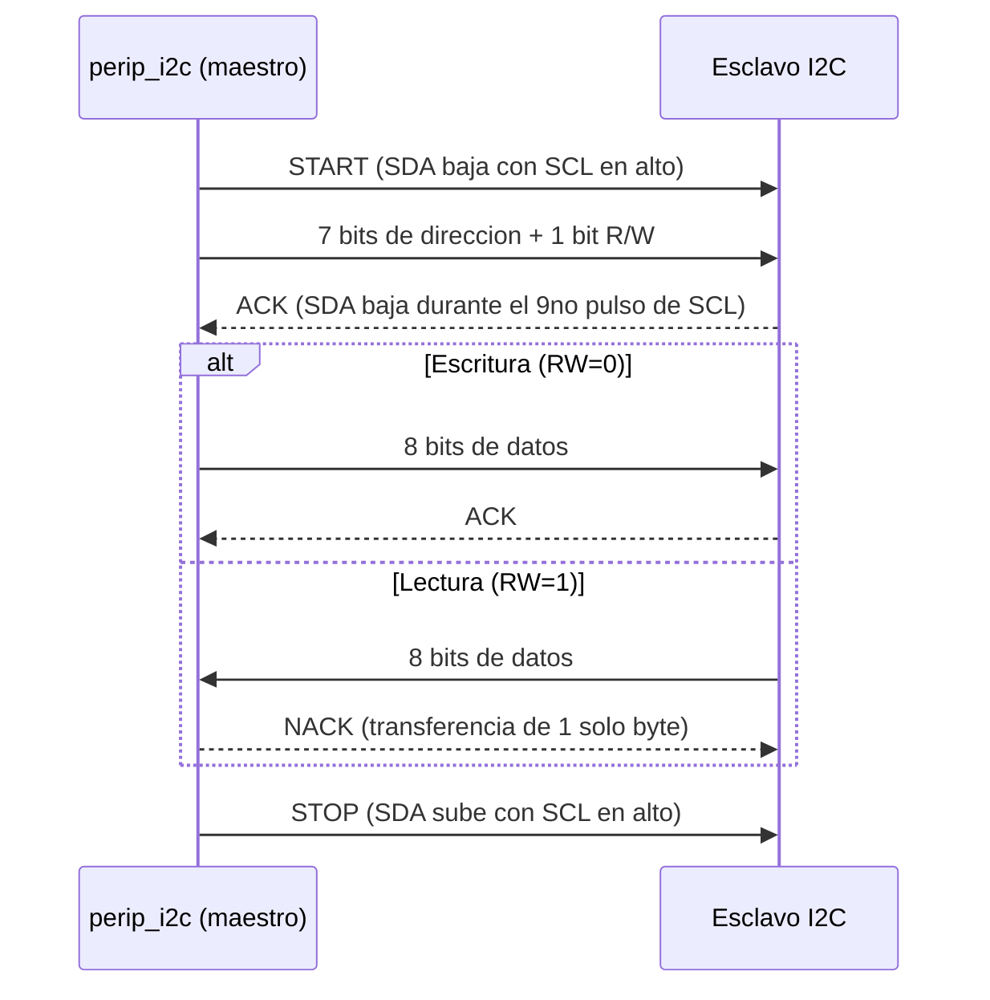
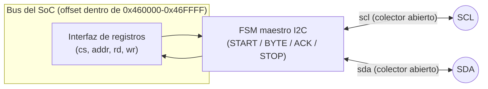

# Diagramas — I2C

## Trama de una transferencia de 1 byte (START, ADDR+RW, ACK, DATA, ACK, STOP)

- Cada bit se establece con `SCL` en bajo y se muestrea con `SCL` en
  alto — nunca al revés (si `SDA` cambia con `SCL` en alto, eso es una
  condición START o STOP, no un bit de datos).
- **Clock stretching**: tras liberar `SCL` para que suba, el maestro
  vuelve a leer la línea antes de darla por alta — si el esclavo la
  retiene en 0 para pedir más tiempo, el maestro simplemente espera
  (ver fase `PH1` en `perip_i2c.v`).

## Diagrama de bloques interno

## Tabla de registros (ver también el README de esta carpeta)

| Registro | Offset | R/W | Bit | Significado |
|---|---|---|---|---|
| `I2C_ADDR` | `0x00` | W | `[6:0]` | Dirección del esclavo (7 bits) |
| `I2C_DATA` | `0x04` | R/W | `[7:0]` | Escribir: byte a mandar. Leer: último byte recibido |
| `I2C_CTRL` | `0x08` | W | bit0 | `start` — pulso: inicia la transacción |
| `I2C_CTRL` | `0x08` | W | bit1 | `rw` — 0=escritura, 1=lectura |
| `I2C_STATUS` | `0x0C` | R | bit0 | `busy` — 1 mientras hay una transacción en curso |
| `I2C_STATUS` | `0x0C` | R | bit1 | `ack_error` — 1 si el esclavo no respondió ACK |
