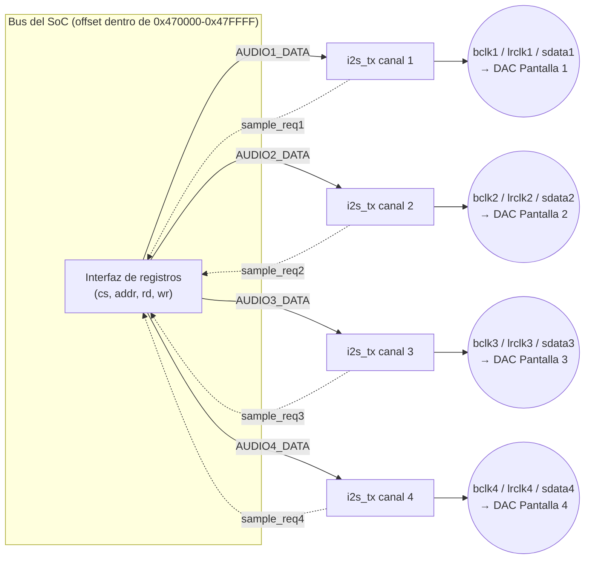

# Diagramas — I2S (Audio)

## Trama I2S (BCLK / LRCLK / SDATA)

```
BCLK   ─┐┌┐┌┐┌┐┌┐┌┐┌┐┌┐┌─┐┌┐┌┐┌┐┌┐┌┐┌┐┌┐┌─
LRCLK  ──────────────────┘└──────────────  (0 = canal izq, 1 = canal der)
SDATA  ──[b15][b14]...[b1][b0]──[b15]...──  (MSB primero, cambia en flanco de bajada de BCLK)
```

- `BCLK` (bit clock): un pulso por cada bit de datos transmitido.
- `LRCLK`/`WS` (word select): indica a qué canal (izquierdo/derecho)
  pertenece el bit actual — en este proyecto se usa mono o estéreo
  simple (ver README).
- `SDATA`: los datos en sí, **MSB primero**, sincronizados al flanco de
  bajada de `BCLK` (ver `perip_i2s.v`, bloque `if (bclk) begin ... end`
  dentro de `i2s_tx`).

## Diagrama de bloques: 4 canales independientes



Los 4 canales **no comparten estado**: cada `i2s_tx` tiene su propio
`shift_reg`, `bclk_count` y `bit_index`. Si el canal de una pantalla
falla o se satura, los otros 3 siguen sonando normal.

## Tabla de registros (ver también el README de esta carpeta)

| Registro | Offset | R/W | Descripción |
|---|---|---|---|
| `AUDIO1_DATA` | `0x00` | W | Muestra de audio para Pantalla 1 |
| `AUDIO2_DATA` | `0x04` | W | Muestra de audio para Pantalla 2 |
| `AUDIO3_DATA` | `0x08` | W | Muestra de audio para Pantalla 3 |
| `AUDIO4_DATA` | `0x0C` | W | Muestra de audio para Pantalla 4 |
| `AUDIO_STATUS` | `0x10` | R | bit0-3 = `sample_req` de cada canal (listo para la siguiente muestra) |
