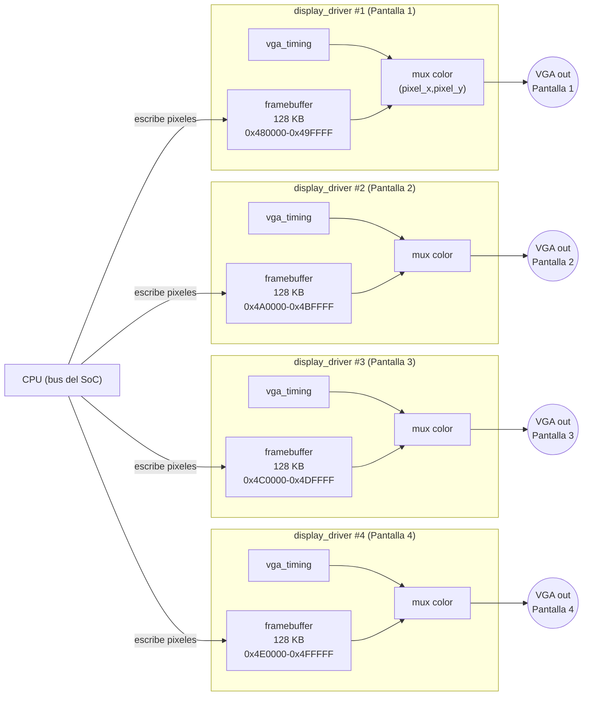

# Diagramas — Display (VGA)

## Timing VGA horizontal (640×480 @ 60 Hz)

```
pixel_x:  0                    640  656        752       800(=0)
          │←── 640 visibles ──→│←FP→│←─ SYNC ─→│←── BP ──→│
video_on: 1111111111111111111110000000000000000000000000
hsync:    1111111111111111111111111000000000001111111111  (activo en bajo)
```

| Parámetro | Horizontal | Vertical |
|---|---|---|
| Píxeles/líneas visibles | 640 | 480 |
| Front porch | 16 | 10 |
| Sync pulse | 96 | 2 |
| Back porch | 48 | 33 |
| Total | 800 | 525 |

Reloj de píxel: **25.175 MHz** (aprox. 25 MHz, generado con un PLL a
partir del reloj de la placa — mismo tipo de PLL que ya usa la carpeta
`pll/` del ejemplo `from-blinker-to-riscv-bruno-levy` del repositorio
del curso). `HSYNC` y `VSYNC` activos en bajo en esta resolución
estándar. Ver la implementación real en
[`../rtl/vga_timing.v`](../rtl/vga_timing.v).

## Diagrama de bloques: 4 pantallas independientes



Cada `display_driver` (timing + framebuffer + mux de color) es
independiente de los otros 3 — igual que el resto de periféricos del
proyecto, si el framebuffer de una pantalla se corrompe o se atrasa,
las otras 3 pantallas no se ven afectadas.

## Tabla de ventanas de framebuffer (ver también el README de esta carpeta)

| Framebuffer | Base | Ventana | Tamaño |
|---|---|---|---|
| `FB1` (Pantalla 1) | `0x00480000` | `0x480000`–`0x49FFFF` | 128 KB |
| `FB2` (Pantalla 2) | `0x004A0000` | `0x4A0000`–`0x4BFFFF` | 128 KB |
| `FB3` (Pantalla 3) | `0x004C0000` | `0x4C0000`–`0x4DFFFF` | 128 KB |
| `FB4` (Pantalla 4) | `0x004E0000` | `0x4E0000`–`0x4FFFFF` | 128 KB |
