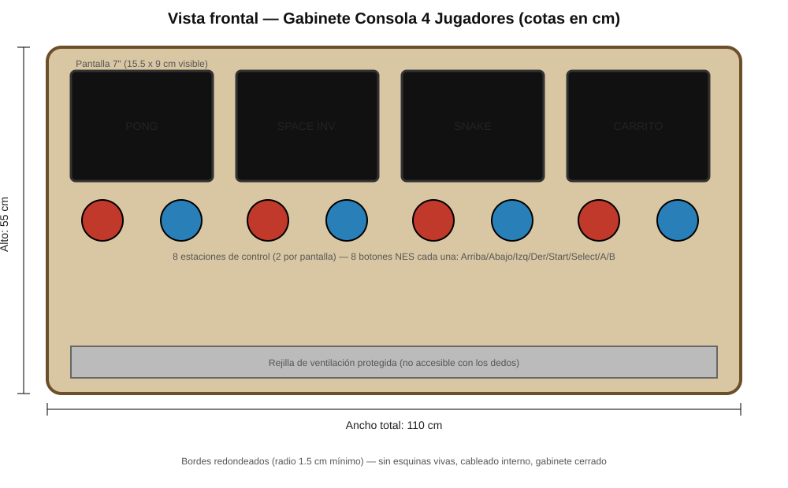
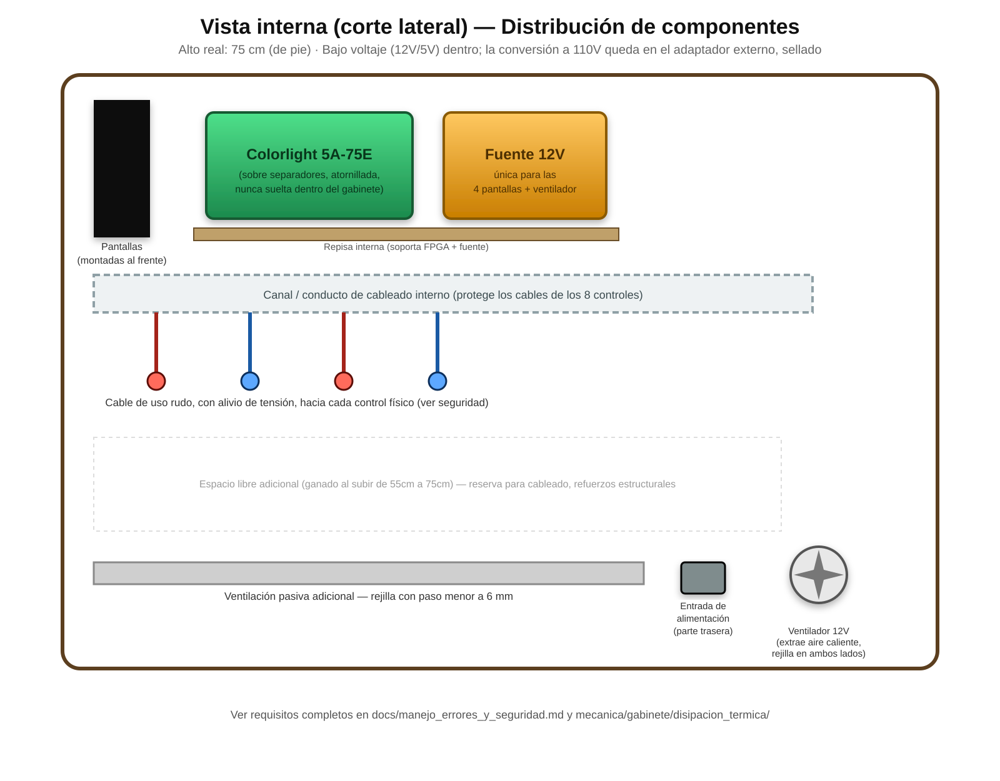

# Gabinete físico de la consola

Diseño completo del gabinete que aloja las 4 pantallas, los 8 controles
y la placa de desarrollo — concepto tipo "mesa arcade" (cocktail
cabinet), pensado para ser construible por el equipo con herramientas
básicas de taller (sierra, taladro, lijadora).

## 1. Concepto y dimensiones

Gabinete tipo mesa, en MDF, con las 4 pantallas en fila sobre la
superficie superior y 2 estaciones de control por pantalla al frente.

**Dimensiones generales**: 110 cm (ancho) × 55 cm (alto) × 45 cm (fondo,
estimado — a ajustar según el espacio real que ocupe la placa FPGA + fuente).

### Vista frontal

### Vista interna (distribución de componentes)

## 2. Lista de materiales (BOM) — precios reales de Colombia, verificados donde se indica

| Ítem | Cantidad | Precio unitario (COP) | Subtotal (COP) | Fuente / verificación |
|---|---|---|---|---|
| Lámina MDF 9mm, 1.83×2.44 m | 1 | **$80.900** | $80.900 | ✅ Verificado — [Homecenter](https://www.homecenter.com.co/homecenter-co/product/904182/mdf-9mm-183x244-metros/904182/) |
| Botón arcade 24mm (con microswitch) | 64 (8 por control × 8 controles) | **$3.600** | $230.400 | ✅ Verificado — MercadoLibre Colombia |
| Pantalla 7" IPS táctil (Waveshare HDMI/VGA o equivalente) | 4 | **US$47.99** (Waveshare oficial) / **$129.013 COP** (alternativa ELECROW real con envío a Colombia) | ~$516.052 COP (con ELECROW) | ✅ Verificado — ver [`cotizacion_pantalla.md`](cotizacion_pantalla.md) para el detalle completo y la decisión pendiente HDMI vs VGA |
| CD4021 (shift register, 1 por control) | 8 | ~$4.000 (estimado) | ~$32.000 | ⚠️ Estimado — no se encontró precio exacto en Colombia, verificar en tienda de electrónica local (ej. cerca de la sede) |
| Cable de uso rudo (para los 8 controles) | ~15 m | ~$2.000/m (estimado) | ~$30.000 | ⚠️ Estimado |
| Conectores DB9 o similares (1 por control) | 8 | ~$1.500 (estimado) | ~$12.000 | ⚠️ Estimado |
| Fuente de alimentación 12V (única, para las 4 pantallas) | 1 | ~$40.000 (estimado, según amperaje real necesario) | ~$40.000 | ⚠️ Estimado — depende del consumo real de las 4 pantallas elegidas (sumar sus datasheets) |
| Bisagras, tornillos, pintura, lija | — | ~$50.000 (estimado) | ~$50.000 | ⚠️ Estimado |
| **Total estimado** | | | **≈ $991.000 COP** | (~US$240 aprox., tasa referencial — actualizado con el precio real de pantalla) |

*(No se incluye la placa Colorlight 5A-75E en este costeo — se asume
provista por el curso, como las demás carpetas de `hardware/` ya
asumen.)*

**Nota importante de honestidad**: los ítems marcados ✅ tienen precio
real verificado a la fecha de esta búsqueda. Los marcados ⚠️ son
estimaciones razonables basadas en productos similares — **cotizar antes
de comprar**, los precios de electrónica cambian rápido y varían por
vendedor.

## 3. Dónde conseguir cada cosa (Bogotá)

- **MDF y herramientas de corte**: Homecenter, Easy, o madereras del
  barrio Siete de Agosto (cerca de la sede Bogotá de la UNAL).
- **Botones arcade, pantallas, CD4021**: MercadoLibre Colombia (envío),
  o tiendas de electrónica en el centro de Bogotá (San Andresito de la
  38, o el sector de la Avenida Caracas con electrónica al detal).
- **Placa Colorlight 5A-75E**: la misma que ya usa el curso — no
  requiere compra adicional si ya la tienen del laboratorio.

## 4. Diseño de cada estación de control

Cada uno de los 8 controles usa el protocolo real documentado en
[`hardware/grupo_G_nes_controller/README.md`](../../hardware/grupo_G_nes_controller/README.md):
8 botones arcade (Arriba, Abajo, Izquierda, Derecha, Start, Select, A, B)
cableados a un **CD4021** (el mismo chip que trae un control de NES
original por dentro), que convierte los 8 botones en una señal serial
de 3 líneas (Latch/Clock/Data) hacia la FPGA.

## 5. Requisitos de seguridad (obligatorios, no opcionales)

Ver [`docs/manejo_errores_y_seguridad.md`](../../docs/manejo_errores_y_seguridad.md#3-seguridad-eléctrica-y-mecánica-del-gabinete):

- Gabinete completamente cerrado, sin PCB expuesta.
- Bordes redondeados (radio mínimo 1.5 cm) en todas las esquinas.
- Cableado de los controles con alivio de tensión y cable de uso rudo
  en los tramos expuestos (ver el caso real "el niño pisó el cable").
- Solo bajo voltaje (12V/5V) dentro del gabinete accesible; la
  conversión de 110V queda en el adaptador externo, sellado.
- Ventilación con paso menor a 6mm (no debe entrar un dedo infantil).
- Conector de alimentación en la parte trasera, no accesible desde
  donde juegan los niños.

## 6. Subcarpetas de diseño detallado

| Tema | Carpeta | Hallazgo real más importante |
|---|---|---|
| Aprovechamiento de la lámina de MDF | [`plano_de_corte/`](plano_de_corte/README.md) | 1 sola lámina alcanza para las 7 piezas (30.950 de 44.652 cm² disponibles) |
| Altura y ángulo pensados para niños | [`ergonomia_infantil/`](ergonomia_infantil/README.md) | Los 55 cm actuales asumen uso sentado — si el uso real es de pie (más probable en un mueble arcade), **hay que subir a ~75 cm** |
| Cálculo de calor y ventilación | [`disipacion_termica/`](disipacion_termica/README.md) | ~22W estimados superan el límite cómodo de ventilación pasiva (~10-15W) — **se recomienda agregar un ventilador de 12V** |
| Cómo fijar las 4 pantallas | [`montaje_pantallas/`](montaje_pantallas/README.md) | Mantener la carcasa de fábrica de cada pantalla y atornillarla desde atrás — no desmontar el panel |
| Nombre, colores y gráficas del producto | [`identidad_visual/`](identidad_visual/README.md) | Propuesta de nombre y paleta de colores, pendiente de que el equipo decida |

## 7. Contenido pendiente
- [x] Bocetos/diagrama del gabinete (vista frontal e interna)
- [x] Plano de distribución de las 4 pantallas y 8 controles
- [x] Lista de materiales con precios reales/estimados
- [x] Plano de corte de la lámina de MDF
- [x] Análisis de ergonomía infantil (con hallazgo pendiente de decidir)
- [x] Cálculo de disipación térmica (con recomendación de ventilador)
- [x] Método de montaje de las pantallas
- [x] Propuesta de identidad visual
- [ ] **Decisión pendiente del equipo**: ¿55cm (sentado) o ~75cm (de
      pie)? Esto obliga a actualizar `vista_frontal.svg`,
      `vista_interna.svg` y el plano de corte si cambia.
- [ ] Ruteo detallado de cableado interno (falta definir largo exacto
      según las dimensiones finales que se decidan)
- [ ] Cotización final una vez se elija el modelo exacto de pantalla
- [ ] Prototipo físico / CAD en software (SketchUp, Fusion 360, o similar)

## Integrantes responsables
-
