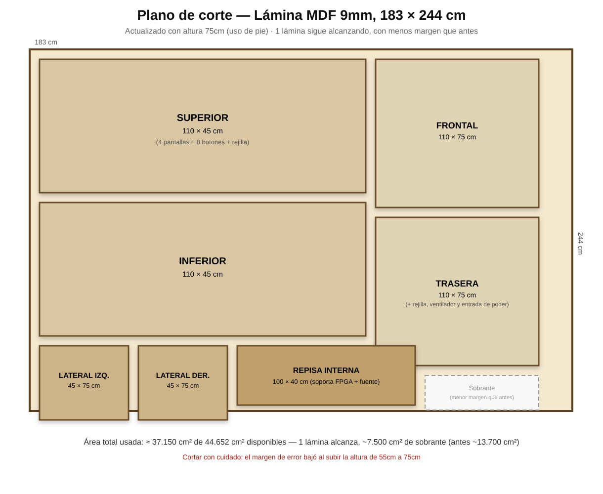

# Plano de corte de la lámina MDF

Aprovechamiento real de la lámina de MDF 9mm (183×244 cm, la que ya está
en el BOM principal) para las 7 piezas que forman el gabinete.

## Piezas necesarias y sus dimensiones

Basado en las cotas del gabinete (110×55×45 cm) definidas en
[`../README.md`](../README.md):

| Pieza | Dimensiones (cm) | Área (cm²) | Notas |
|---|---|---|---|
| Superior | 110 × 45 | 4.950 | Lleva los recortes de las 4 pantallas, los 8 huecos de botones y la rejilla de ventilación |
| Inferior | 110 × 45 | 4.950 | Base del gabinete |
| Frontal | 110 × 55 | 6.050 | Cara visible frontal |
| Trasera | 110 × 55 | 6.050 | Lleva el recorte de la rejilla trasera y el conector de alimentación |
| Lateral izquierdo | 45 × 55 | 2.475 | |
| Lateral derecho | 45 × 55 | 2.475 | |
| Repisa interna | 100 × 40 | 4.000 | Soporta la FPGA y la fuente, un poco más pequeña que la base para dejar espacio al cableado |
| **Total** | | **30.950 cm²** | |

**Área disponible en la lámina**: 183 cm × 244 cm = **44.652 cm²**.

**Conclusión real**: con 30.950 cm² necesarios contra 44.652 cm²
disponibles, **una sola lámina alcanza**, dejando ~13.700 cm² de
sobrante para margen de error de corte (el kerf real de la sierra,
~3-5mm por corte, se come parte de ese sobrante — no es 100%
aprovechable, pero hay margen de sobra).

## Recomendaciones de corte reales

- Cortar primero las piezas más grandes (Superior, Inferior, Frontal,
  Trasera) y dejar las piezas chicas (laterales, repisa) para el
  final, usando los recortes sobrantes — es la práctica estándar de
  carpintería para minimizar desperdicio.
- Los recortes de las 4 pantallas y los 8 botones en la pieza
  "Superior" se hacen DESPUÉS de cortar el rectángulo general, nunca
  antes (una pieza con huecos es más frágil de manipular en la sierra).
- Si el taller de la universidad tiene router CNC o corte láser
  (frecuente en un fablab), es preferible para los recortes de
  pantallas/botones (más precisión que con taladro + caladora manual).

## Pendiente
- [ ] Definir las coordenadas exactas de los recortes de pantalla en la
  pieza Superior (depende del modelo final de pantalla elegido, ver
  [`../cotizacion_pantalla.md`](../cotizacion_pantalla.md))
- [ ] Confirmar con el taller/fablab de la universidad qué herramientas
  de corte están disponibles

## Integrantes responsables
-
