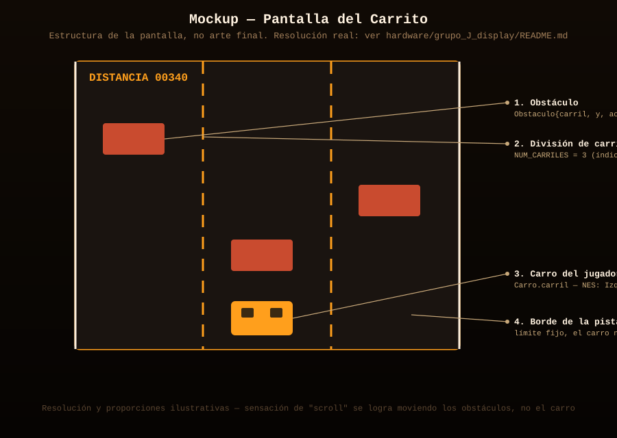
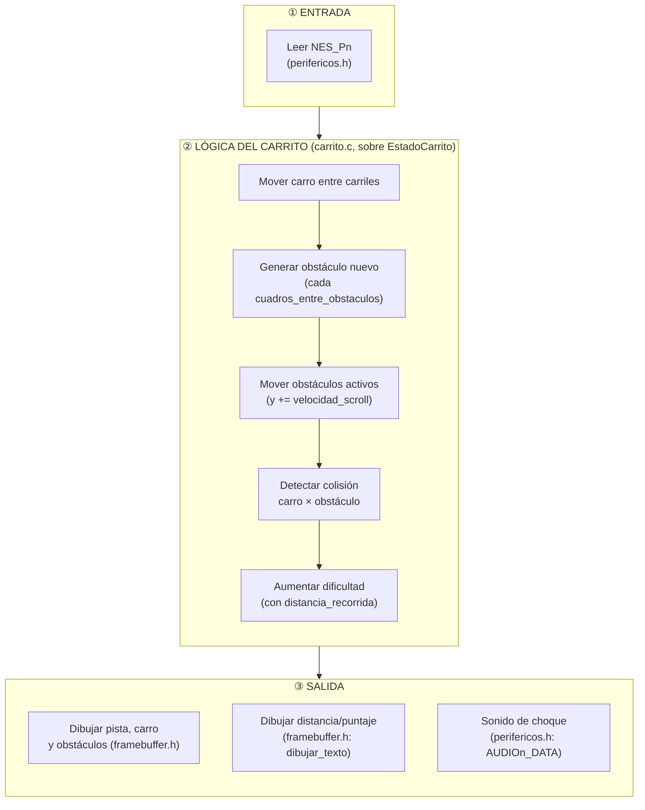
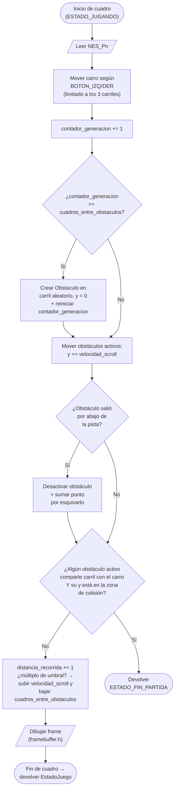

# Juego de Carrito

Esquivar obstáculos en una pista que se desplaza, pierde al chocar. Un jugador, un control NES (`NES_Pn`, según a qué pantalla esté conectado este juego).

Sigue la máquina de estados general documentada en
[`docs/logica_juegos.md`](../../../docs/logica_juegos.md)
(Menu → Configurando → Jugando → Pausa/Punto → FinPartida → ErrorControl/ErrorFatal).
Este documento detalla la lógica **específica** del Carrito dentro del estado `ESTADO_JUGANDO`.

## Estructura de código (sin lógica todavía)

Este juego se conecta al resto del sistema implementando la interfaz
`InterfazJuego` definida en [`../comun/juego.h`](../comun/juego.h),
declarada en [`carrito.h`](carrito.h):

```c
extern const InterfazJuego JUEGO_CARRITO;
```

Las estructuras de datos internas ya están declaradas en
[`entidades_carrito.h`](entidades_carrito.h):

```c
typedef struct { int carril; } Carro;
typedef struct { int carril; int y; int activo; } Obstaculo;
typedef struct { Carro carro; Obstaculo obstaculos[6]; int velocidad_scroll; int distancia_recorrida; int contador_generacion; int cuadros_entre_obstaculos; } EstadoCarrito;
```

Falta por crear `carrito.c`, donde se va a definir `JUEGO_CARRITO` y a
implementar la lógica real sobre `EstadoCarrito`.

### Estructura de carpetas de este juego

```
carrito/
├── README.md               (este archivo)
├── carrito.h                — contrato: declara JUEGO_CARRITO
├── entidades_carrito.h       — estructuras internas: Carro, Obstaculo, EstadoCarrito
├── mockup_pantalla.svg       — mockup visual de cómo se va a ver la pantalla
└── carrito.c                — (no existe aún) implementación real
```

## Entidades

| Entidad | Struct | Descripción |
|---|---|---|
| Carro | `Carro` | Solo guarda `carril` (0 a `NUM_CARRILES-1`); no tiene posición Y libre |
| Obstáculo | `Obstaculo` | Aparece arriba en un carril aleatorio, baja hasta salir de pantalla o chocar |
| Pista | `NUM_CARRILES` (constante) | 3 carriles fijos; la sensación de movimiento la dan los obstáculos, no el carro |
| Dificultad | `velocidad_scroll` / `cuadros_entre_obstaculos` | Ambos evolucionan con el tiempo/puntaje (ver diagrama de flujo) |

**Nota de diseño**: el carro **no se mueve verticalmente ni tiene
posición X libre** — solo cambia de carril (movimiento discreto). Esto
simplifica muchísimo tanto la detección de colisión (comparar
`carril` con `carril`, un entero) como el dibujo en baja resolución.

## Controles (NES, ver `hardware/grupo_G_nes_controller`)

| Botón | Acción |
|---|---|
| `BOTON_IZQ` | `carro.carril -= 1` (sin bajar de 0) |
| `BOTON_DER` | `carro.carril += 1` (sin pasar de `NUM_CARRILES - 1`) |
| `BOTON_START` | Pausar / reanudar |
| Resto de botones | Sin uso en este juego |

## Mockup de la pantalla



## Diagrama de bloques (arquitectura interna)

Organización jerárquica: **Entrada → Lógica del Carrito (generación, movimiento y colisión, en ese orden) → Salida**.



## Diagrama de flujo (lógica de un cuadro en `ESTADO_JUGANDO`)

**Convenciones del diagrama** (simbología estándar de diagramas de flujo):

| Símbolo | Significado |
|---|---|
| ⬭ Óvalo (terminal) | Inicio / fin del flujo |
| ▱ Paralelogramo | Entrada o salida de datos |
| ▭ Rectángulo | Proceso / acción |
| ◇ Rombo | Decisión (condicional, dos salidas) |



## Estado
- [x] Lógica del juego diseñada (diagramas de arriba)
- [x] Estructura de código creada (`carrito.h`, `entidades_carrito.h`)
- [x] Mockup visual de la pantalla
- [ ] Implementado en C sobre el RISC-V (femtoriscv) — falta `carrito.c`
- [ ] Probado con los periféricos reales (control, pantalla, sonido)
- [ ] Manejo de errores implementado (ver `docs/manejo_errores_y_seguridad.md`)

## Assets necesarios (sprites, sonidos)
- Sprite del carro del jugador
- Sprite de obstáculo (puede reutilizar el mismo con distinto color por dificultad)
- Fondo/textura simple de pista (líneas divisorias de carril)
- Fuente bitmap para la distancia/puntaje — reutiliza `framebuffer.h: dibujar_texto`
- Sonido de choque, sonido de "game over"

## Integrantes responsables de este juego
-
