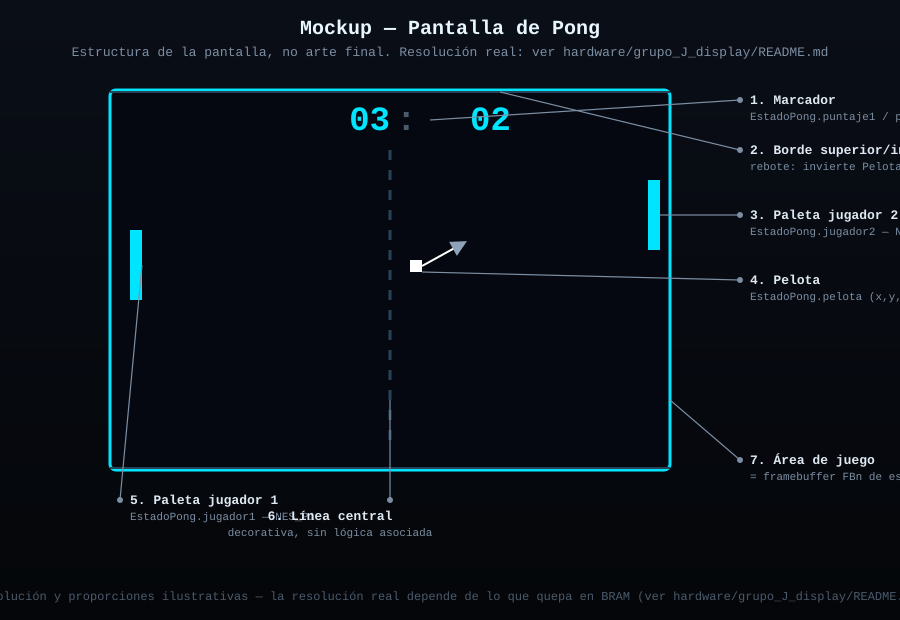
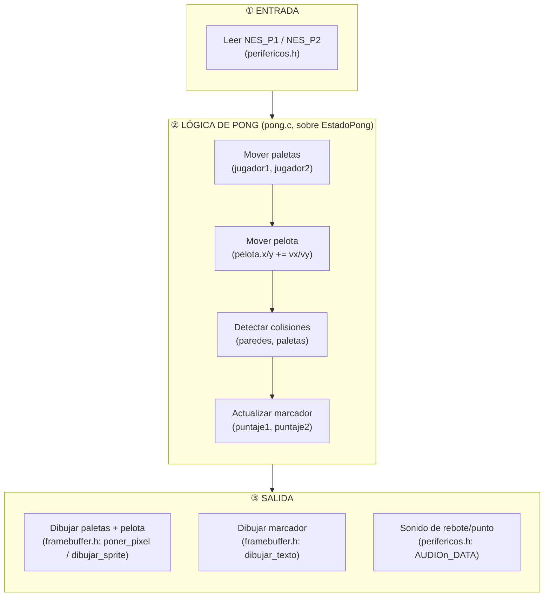
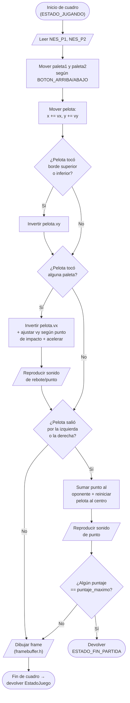

# Pong

Dos paletas, una pelota, primero en llegar al puntaje máximo gana. Multijugador local (2 jugadores, 2 controles NES — `NES_P1`, `NES_P2`).

Sigue la máquina de estados general documentada en
[`docs/logica_juegos.md`](../../../docs/logica_juegos.md)
(Menu → Configurando → Jugando → Pausa/Punto → FinPartida → ErrorControl/ErrorFatal).
Este documento detalla la lógica **específica** de Pong dentro del estado `ESTADO_JUGANDO`.

## Estructura de código (sin lógica todavía)

Este juego se conecta al resto del sistema implementando la interfaz
`InterfazJuego` definida en [`../comun/juego.h`](../comun/juego.h).
Ya existe la declaración de esa conexión en [`pong.h`](pong.h):

```c
extern const InterfazJuego JUEGO_PONG;
```

Las estructuras de datos internas (qué necesita recordar Pong entre un
cuadro y el siguiente) ya están declaradas en
[`entidades_pong.h`](entidades_pong.h):

```c
typedef struct { int y; int alto; int velocidad; } Paleta;
typedef struct { int x, y; int vx, vy; int velocidad_base; } Pelota;
typedef struct { Paleta jugador1; Paleta jugador2; Pelota pelota; int puntaje1; int puntaje2; int puntaje_maximo; } EstadoPong;
```

Falta por crear `pong.c`, donde se va a definir `JUEGO_PONG` y a
implementar la lógica real sobre `EstadoPong`. `main.c` (en
`../comun/`) solo va a conocer `JUEGO_PONG` a través de `pong.h` —
nunca va a necesitar saber cómo funciona Pong por dentro.

### Estructura de carpetas de este juego

```
pong/
├── README.md              (este archivo)
├── pong.h                 — contrato: declara JUEGO_PONG (InterfazJuego)
├── entidades_pong.h        — estructuras internas: Paleta, Pelota, EstadoPong
├── mockup_pantalla.svg     — mockup visual de cómo se va a ver la pantalla
└── pong.c                 — (no existe aún) implementación real
```

## Entidades

| Entidad | Struct | Descripción |
|---|---|---|
| Paleta jugador 1 | `Paleta` | Lado izquierdo, se mueve vertical, controlada por `NES_P1` |
| Paleta jugador 2 | `Paleta` | Lado derecho, se mueve vertical, controlada por `NES_P2` |
| Pelota | `Pelota` | Se mueve en línea recta, rebota contra paredes y paletas |
| Marcador | `int, int` (en `EstadoPong`) | Puntaje de cada jugador, contra `puntaje_maximo` |

## Controles (NES, ver `hardware/grupo_G_nes_controller`)

| Botón | Jugador 1 (`NES_P1`) | Jugador 2 (`NES_P2`) |
|---|---|---|
| `BOTON_ARRIBA` | Subir paleta | Subir paleta |
| `BOTON_ABAJO` | Bajar paleta | Bajar paleta |
| `BOTON_START` | Pausar / reanudar (cualquiera de los dos) | ídem |
| Resto de botones | Sin uso en este juego | Sin uso en este juego |

## Mockup de la pantalla



## Diagrama de bloques (arquitectura interna)

Organización jerárquica: **Entrada → Lógica de Pong (sobre `EstadoPong`) → Salida**. Ningún bloque de "Lógica" conoce el hardware directamente — todos pasan por `perifericos.h` o `framebuffer.h`.



## Diagrama de flujo (lógica de un cuadro en `ESTADO_JUGANDO`)

**Convenciones del diagrama** (simbología estándar de diagramas de flujo):

| Símbolo | Significado |
|---|---|
| ⬭ Óvalo (terminal) | Inicio / fin del flujo |
| ▱ Paralelogramo | Entrada o salida de datos |
| ▭ Rectángulo | Proceso / acción |
| ◇ Rombo | Decisión (condicional, dos salidas) |



## Estado
- [x] Lógica del juego diseñada (diagramas de arriba)
- [x] Estructura de código creada (`pong.h`, `entidades_pong.h`)
- [x] Mockup visual de la pantalla
- [ ] Implementado en C sobre el RISC-V (femtoriscv) — falta `pong.c`
- [ ] Probado con los periféricos reales (control, pantalla, sonido)
- [ ] Manejo de errores implementado (ver `docs/manejo_errores_y_seguridad.md`)

## Assets necesarios (sprites, sonidos)
- Sprite de paleta (rectángulo simple, puede ser 1 solo color)
- Sprite de pelota (cuadrado simple)
- Fuente bitmap para el marcador (reutiliza `framebuffer.h: dibujar_texto`)
- Sonido de rebote (corto, ~50ms) y sonido de punto (corto, distinto tono)

## Integrantes responsables de este juego
-
