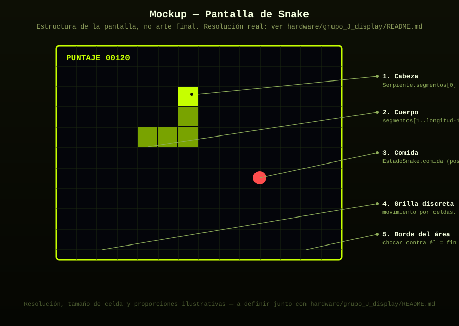
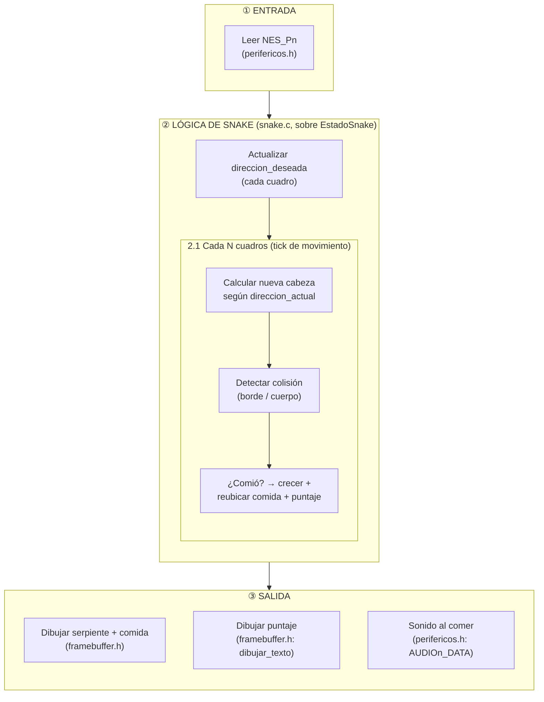
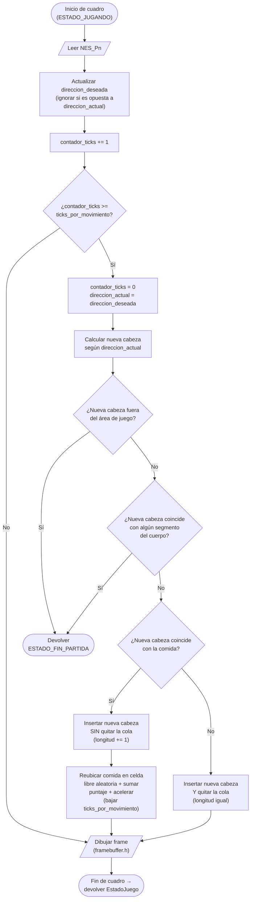

# Snake

La serpiente crece al comer, pierde al chocar contra el borde o contra sí misma. Un jugador, un control NES (`NES_Pn`, según a qué pantalla esté conectado este juego).

Sigue la máquina de estados general documentada en
[`docs/logica_juegos.md`](../../../docs/logica_juegos.md)
(Menu → Configurando → Jugando → Pausa/Punto → FinPartida → ErrorControl/ErrorFatal).
Este documento detalla la lógica **específica** de Snake dentro del estado `ESTADO_JUGANDO`.

## Estructura de código (sin lógica todavía)

Este juego se conecta al resto del sistema implementando la interfaz
`InterfazJuego` definida en [`../comun/juego.h`](../comun/juego.h),
declarada en [`snake.h`](snake.h):

```c
extern const InterfazJuego JUEGO_SNAKE;
```

Las estructuras de datos internas ya están declaradas en
[`entidades_snake.h`](entidades_snake.h):

```c
typedef struct { int x, y; } Punto;
typedef enum { DIR_ARRIBA, DIR_ABAJO, DIR_IZQUIERDA, DIR_DERECHA } Direccion;
typedef struct { Punto segmentos[256]; int longitud; Direccion direccion_actual; Direccion direccion_deseada; } Serpiente;
typedef struct { Serpiente serpiente; Punto comida; int puntaje; int contador_ticks; int ticks_por_movimiento; } EstadoSnake;
```

Falta por crear `snake.c`, donde se va a definir `JUEGO_SNAKE` y a
implementar la lógica real sobre `EstadoSnake`.

### Estructura de carpetas de este juego

```
snake/
├── README.md               (este archivo)
├── snake.h                 — contrato: declara JUEGO_SNAKE
├── entidades_snake.h        — estructuras internas: Punto, Direccion, Serpiente, EstadoSnake
├── mockup_pantalla.svg      — mockup visual de cómo se va a ver la pantalla
└── snake.c                 — (no existe aún) implementación real
```

## Entidades

| Entidad | Struct | Descripción |
|---|---|---|
| Serpiente | `Serpiente` | Arreglo de `Punto` (celdas de grilla), `segmentos[0]` es la cabeza |
| Comida | `Punto` (en `EstadoSnake`) | Una sola celda a la vez, se reubica al azar al comerse |
| Dirección | `Direccion` (enum) | `direccion_actual` vs `direccion_deseada` — separadas para evitar giro de 180° instantáneo |
| Reloj de movimiento | `contador_ticks` / `ticks_por_movimiento` | Snake se mueve más lento que el refresco de pantalla (ver más abajo) |

**Nota de diseño importante**: a diferencia de Pong o Space Invaders,
Snake **no se mueve cada cuadro** — se movería demasiado rápido para
ser jugable. El movimiento real ocurre solo cuando
`contador_ticks >= ticks_por_movimiento`; el resto de los cuadros solo
se vuelve a dibujar el mismo estado. Esto es lo que refleja el rombo
"¿Toca mover?" en el diagrama de flujo de abajo.

## Controles (NES, ver `hardware/grupo_G_nes_controller`)

| Botón | Acción |
|---|---|
| `BOTON_ARRIBA` | Fijar `direccion_deseada = DIR_ARRIBA` (ignorado si la actual es `DIR_ABAJO`) |
| `BOTON_ABAJO` | Fijar `direccion_deseada = DIR_ABAJO` (ignorado si la actual es `DIR_ARRIBA`) |
| `BOTON_IZQ` | Fijar `direccion_deseada = DIR_IZQUIERDA` (ignorado si la actual es `DIR_DERECHA`) |
| `BOTON_DER` | Fijar `direccion_deseada = DIR_DERECHA` (ignorado si la actual es `DIR_IZQUIERDA`) |
| `BOTON_START` | Pausar / reanudar |

## Mockup de la pantalla



## Diagrama de bloques (arquitectura interna)

Organización jerárquica: **Entrada → Lógica de Snake (separada en "cada cuadro" vs "cada tick de movimiento") → Salida**.



## Diagrama de flujo (lógica de un cuadro en `ESTADO_JUGANDO`)

**Convenciones del diagrama** (simbología estándar de diagramas de flujo):

| Símbolo | Significado |
|---|---|
| ⬭ Óvalo (terminal) | Inicio / fin del flujo |
| ▱ Paralelogramo | Entrada o salida de datos |
| ▭ Rectángulo | Proceso / acción |
| ◇ Rombo | Decisión (condicional, dos salidas) |



## Estado
- [x] Lógica del juego diseñada (diagramas de arriba)
- [x] Estructura de código creada (`snake.h`, `entidades_snake.h`)
- [x] Mockup visual de la pantalla
- [ ] Implementado en C sobre el RISC-V (femtoriscv) — falta `snake.c`
- [ ] Probado con los periféricos reales (control, pantalla, sonido)
- [ ] Manejo de errores implementado (ver `docs/manejo_errores_y_seguridad.md`)

## Assets necesarios (sprites, sonidos)
- Sprite de segmento de cuerpo (un solo color, cuadrado)
- Sprite de cabeza (mismo cuadrado, color distinto o con "ojos")
- Sprite de comida (círculo o cuadrado de otro color)
- Fuente bitmap para el puntaje — reutiliza `framebuffer.h: dibujar_texto`
- Sonido corto al comer, sonido de "game over"

## Integrantes responsables de este juego
-
