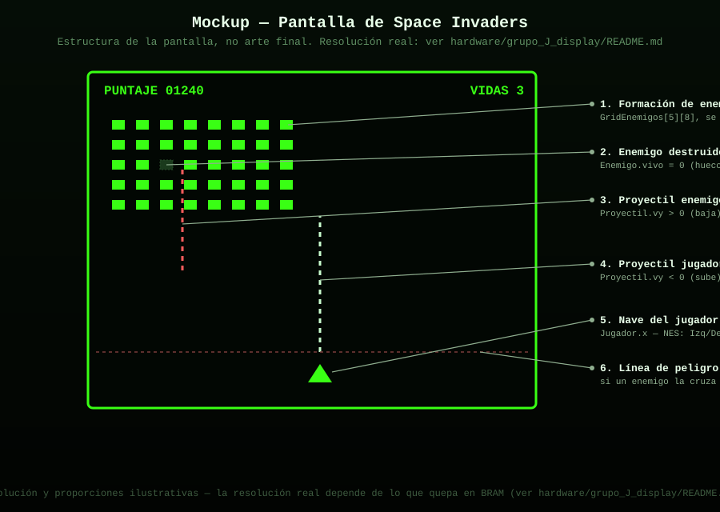
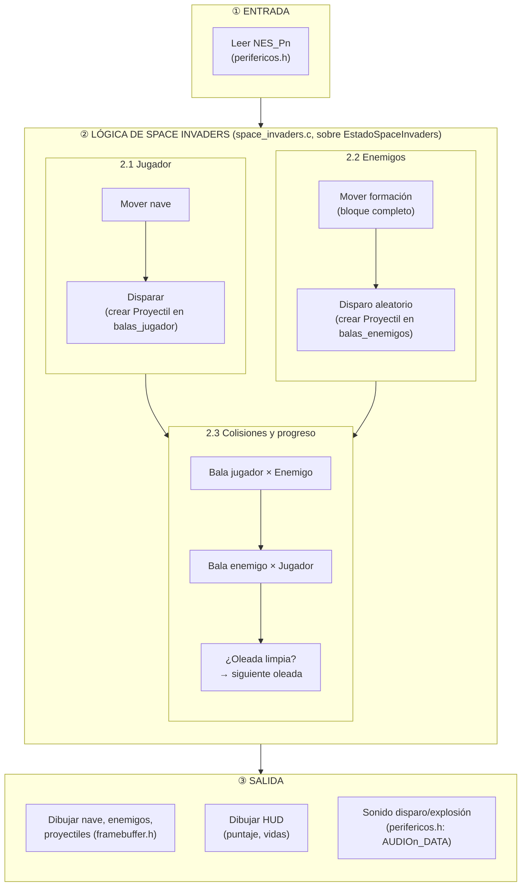

# Space Invaders

Oleadas de enemigos que bajan, el jugador dispara desde abajo, pierde vidas al ser alcanzado. Un jugador, un control NES (`NES_Pn`, según a qué pantalla esté conectado este juego).

Sigue la máquina de estados general documentada en
[`docs/logica_juegos.md`](../../../docs/logica_juegos.md)
(Menu → Configurando → Jugando → Pausa/Punto → FinPartida → ErrorControl/ErrorFatal).
Este documento detalla la lógica **específica** de Space Invaders dentro del estado `ESTADO_JUGANDO`.

## Estructura de código (sin lógica todavía)

Este juego se conecta al resto del sistema implementando la interfaz
`InterfazJuego` definida en [`../comun/juego.h`](../comun/juego.h),
declarada en [`space_invaders.h`](space_invaders.h):

```c
extern const InterfazJuego JUEGO_SPACE_INVADERS;
```

Las estructuras de datos internas ya están declaradas en
[`entidades_space_invaders.h`](entidades_space_invaders.h):

```c
typedef struct { int x; int vidas; } Jugador;
typedef struct { int x, y; int vivo; } Enemigo;
typedef struct { Enemigo enemigos[5][8]; int direccion; int velocidad; int enemigos_vivos; } GridEnemigos;
typedef struct { int x, y; int vy; int activo; } Proyectil;
typedef struct { Jugador jugador; GridEnemigos enemigos; Proyectil balas_jugador[4]; Proyectil balas_enemigos[4]; int oleada; int puntaje; } EstadoSpaceInvaders;
```

Falta por crear `space_invaders.c`, donde se va a definir
`JUEGO_SPACE_INVADERS` y a implementar la lógica real sobre
`EstadoSpaceInvaders`.

### Estructura de carpetas de este juego

```
space_invaders/
├── README.md                          (este archivo)
├── space_invaders.h                   — contrato: declara JUEGO_SPACE_INVADERS
├── entidades_space_invaders.h          — estructuras internas: Jugador, Enemigo, GridEnemigos, Proyectil
├── mockup_pantalla.svg                 — mockup visual de cómo se va a ver la pantalla
└── space_invaders.c                   — (no existe aún) implementación real
```

## Entidades

| Entidad | Struct | Descripción |
|---|---|---|
| Jugador | `Jugador` | Nave en la fila inferior, se mueve solo en X, tiene vidas |
| Formación de enemigos | `GridEnemigos` (5×8 `Enemigo`) | Se mueve como un solo bloque; acelera conforme mueren enemigos |
| Proyectil del jugador | `Proyectil` (`vy < 0`) | Sube desde la nave, máx. `MAX_PROYECTILES_JUGADOR` a la vez |
| Proyectil enemigo | `Proyectil` (`vy > 0`) | Baja desde un enemigo elegido al azar, máx. `MAX_PROYECTILES_ENEMIGOS` a la vez |
| Oleada | `int oleada` (en `EstadoSpaceInvaders`) | Aumenta la dificultad cuando se limpia toda la formación |

## Controles (NES, ver `hardware/grupo_G_nes_controller`)

| Botón | Acción |
|---|---|
| `BOTON_IZQ` | Mover nave a la izquierda |
| `BOTON_DER` | Mover nave a la derecha |
| `BOTON_A` | Disparar (respetando cooldown / slots libres en `balas_jugador`) |
| `BOTON_START` | Pausar / reanudar |

## Mockup de la pantalla



## Diagrama de bloques (arquitectura interna)

Organización jerárquica: **Entrada → Lógica de Space Invaders (dos sub-bloques independientes que convergen en colisiones) → Salida**.



## Diagrama de flujo (lógica de un cuadro en `ESTADO_JUGANDO`)

**Convenciones del diagrama** (simbología estándar de diagramas de flujo):

| Símbolo | Significado |
|---|---|
| ⬭ Óvalo (terminal) | Inicio / fin del flujo |
| ▱ Paralelogramo | Entrada o salida de datos |
| ▭ Rectángulo | Proceso / acción |
| ◇ Rombo | Decisión (condicional, dos salidas) |

El flujo se organiza en 3 fases secuenciales, cada una en su propio bloque, para que se pueda leer de arriba hacia abajo sin cruces:

```mermaid
flowchart TD
    Inicio(["Inicio de cuadro\n(ESTADO_JUGANDO)"])
    Entrada[/"Leer NES_Pn"/]

    subgraph FASE1["Fase 1 — Jugador"]
        direction TD
        MoverNave["Mover nave según\nBOTON_IZQ/DER"]
        Dispara{"¿BOTON_A y hay\nslot libre en\nbalas_jugador?"}
        CrearBala["Crear Proyectil\n(vy negativo)"]
        MoverNave --> Dispara
        Dispara -- "Sí" --> CrearBala
        Dispara -- "No" --> MoverBalasJ
        CrearBala --> MoverBalasJ["Mover balas_jugador\n(y += vy)"]
    end

    subgraph FASE2["Fase 2 — Enemigos"]
        direction TD
        MoverGrid["Mover GridEnemigos\n(x += direccion × velocidad)"]
        Borde{"¿Algún enemigo\nllegó al borde\nlateral?"}
        Bajar["Invertir dirección\n+ bajar una fila\ntoda la formación"]
        DisparoAleatorio{"¿Toca disparo\nenemigo este\ncuadro? (azar)"}
        CrearBalaE["Crear Proyectil\nenemigo (vy positivo)"]
        MoverGrid --> Borde
        Borde -- "Sí" --> Bajar --> DisparoAleatorio
        Borde -- "No" --> DisparoAleatorio
        DisparoAleatorio -- "Sí" --> CrearBalaE --> MoverBalasE
        DisparoAleatorio -- "No" --> MoverBalasE["Mover balas_enemigos\n(y += vy)"]
    end

    subgraph FASE3["Fase 3 — Colisiones y fin de ronda"]
        direction TD
        ColJE{"¿Bala jugador ×\nEnemigo vivo?"}
        MatarEnemigo["Enemigo.vivo = 0\n+ sumar puntaje\n+ desactivar bala"]
        ColEJ{"¿Bala enemigo ×\nJugador?"}
        PerderVida["vidas -= 1\n+ desactivar bala"]
        SinVidas{"¿vidas == 0?"}
        LineaPeligro{"¿Algún enemigo\ncruzó la línea\nde peligro?"}
        OleadaLimpia{"¿enemigos_vivos\n== 0?"}
        SiguienteOleada["oleada += 1\nreiniciar GridEnemigos\ncon más velocidad"]

        ColJE -- "Sí" --> MatarEnemigo --> ColEJ
        ColJE -- "No" --> ColEJ
        ColEJ -- "Sí" --> PerderVida --> SinVidas
        ColEJ -- "No" --> SinVidas
        SinVidas -- "No" --> LineaPeligro
        LineaPeligro -- "No" --> OleadaLimpia
        OleadaLimpia -- "Sí" --> SiguienteOleada
    end

    Dibujar[/"Dibujar frame + HUD\n(framebuffer.h)"/]
    Fin(["Fin de cuadro →\ndevolver EstadoJuego"])
    FinPartida(["Devolver\nESTADO_FIN_PARTIDA"])

    Inicio --> Entrada --> FASE1 --> FASE2 --> FASE3
    SinVidas -- "Sí" --> FinPartida
    LineaPeligro -- "Sí" --> FinPartida
    OleadaLimpia -- "No" --> Dibujar --> Fin
    SiguienteOleada --> Dibujar
```



## Estado
- [x] Lógica del juego diseñada (diagramas de arriba)
- [x] Estructura de código creada (`space_invaders.h`, `entidades_space_invaders.h`)
- [x] Mockup visual de la pantalla
- [ ] Implementado en C sobre el RISC-V (femtoriscv) — falta `space_invaders.c`
- [ ] Probado con los periféricos reales (control, pantalla, sonido)
- [ ] Manejo de errores implementado (ver `docs/manejo_errores_y_seguridad.md`)

## Assets necesarios (sprites, sonidos)
- Sprite de nave del jugador
- Sprite(s) de enemigo (idealmente 1-2 cuadros de animación por fila para dar sensación de movimiento)
- Sprite de proyectil (jugador y enemigo pueden compartir el mismo, con color distinto)
- Fuente bitmap para HUD (puntaje, vidas) — reutiliza `framebuffer.h: dibujar_texto`
- Sonido de disparo, sonido de explosión de enemigo, sonido de "game over"

## Integrantes responsables de este juego
-
